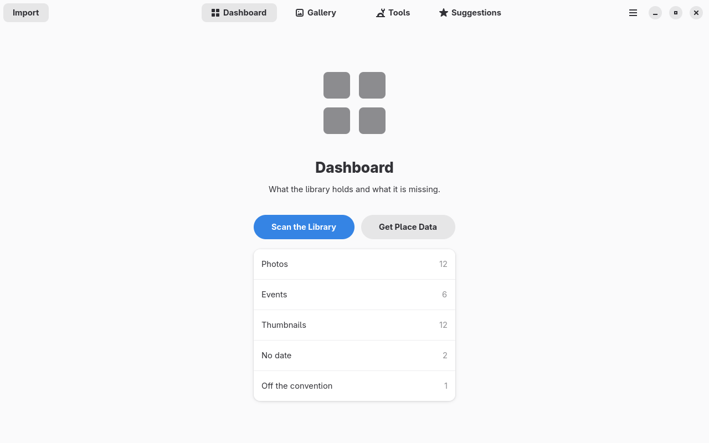

<p align="center">
  
</p>

<h1 align="center">photoManager</h1>

<p align="center">
  <a href="https://github.com/xuedi/photoManager/actions/workflows/ci.yml"></a>
  <a href="https://github.com/xuedi/photoManager/releases"></a>
  <a href="LICENSE"></a>
  <a href="https://www.rust-lang.org"></a>
  
</p>

<p align="center"><b>Put your photo library's data in order.</b><br>
See what is missing - places, dates, tags, people - fix it in bulk with a preview before<br>
every change, and never lose a byte of the original image.</p>

---

A photo library that has been going for twenty years has been through a few programs, and each one
left its own mess behind. Tags in four different fields that disagree. Dates in XMP that are two
hours behind the same date in EXIF. Eleven thousand photos that say which city they were taken in,
and only seven hundred that carry the coordinates. A keyword that ended up in the rating label
because some old version put it there.

photoManager is a GNOME application for fixing exactly that, in bulk, on your own machine. It is
not another viewer. It is the thing that finds what is wrong, shows you what it would change, and
changes it only when you say so.

<p align="center"></p>

## Why photoManager

- **The photos are the truth.** Every piece of information lives in the files themselves, in
  EXIF, IPTC and XMP. The database is a cache and can be deleted at any moment: the application
  reads it all back from the photos. Nothing about your library exists only in a program's
  private storage, so nothing is lost when the program is.
- **Nothing is written without a preview you confirmed.** Bulk operations are dry-run first, and
  nothing happens in the background or on its own. A button was pressed, or nothing moved.
- **Proved, not hoped.** Every write is made to a copy beside the original, checked, and only then
  renamed over it. The image data is proved untouched twice - by a hash of our own and by
  ExifTool's `ImageDataHash` - before the original is replaced. If anything is off, the copy is
  deleted and the library never changed.
- **Every change can be taken back.** What a photo said before a write is committed to a journal
  first, so an undo can put it back field by field. The journal outlives a cache rebuild, because
  those old values are the only copy of what the photo used to say.
- **A photo is known by its pixels.** The identity is a hash of the image data with the metadata
  segments left out, so it survives a metadata write, a rename and a move. A photo that moved is
  recognised as the same photo, not as one deleted and one added.
- **It works offline.** Place names and country outlines come from the GeoNames dumps, imported
  once into a local database. No service is asked where your photos were taken.
- **It plays well with what you already run.** Writes are embedded in the file, never in a
  sidecar, and in every field the common readers look at, so Immich, digiKam and Shotwell all see
  the same thing. The modification time is deliberately updated, so Nextcloud syncs the file and
  Immich reads it again.

## Where it is

Early, and honest about it. The foundation is finished and tested; the tools that will use it are
being built one at a time.

| Done | |
|------|--|
| scan and cache | the library in SQLite, rebuildable from the files, with the issues it found |
| metadata | two readers that agree: gexiv2 in process, ExifTool as the reference |
| thumbnails | keyed by the image rather than the path, so a move costs nothing |
| places | GeoNames names to coordinates and back, without the network |
| the write engine | one safe write, proved, journaled, undoable - see [docs/writing.md](docs/writing.md) |

Next is the preview and the apply button that put the write engine behind a user interface, and
then the tools themselves: coordinates from the places tag, dates, tag cleanup, people.

The write engine is finished and proved, but **nothing in the window reaches it yet**. Until the
preview exists, the only photos it has ever touched are test copies.

## Build and run

Needs a Rust toolchain (1.92+), GTK 4, libadwaita, gexiv2, libjpeg-turbo, `blueprint-compiler`,
`just` and `exiftool`.

```bash
# Arch Linux
sudo pacman -S rust gtk4 libadwaita libgexiv2 libjpeg-turbo blueprint-compiler just perl-image-exiftool
# Debian / Ubuntu
sudo apt install cargo libgtk-4-dev libadwaita-1-dev libgexiv2-dev libturbojpeg0-dev blueprint-compiler just libimage-exiftool-perl
```

```console
$ just build     # debug build
$ just run       # run it against your library
$ just check     # format, lint and test
$ just fixture   # write a small stand-in library to /tmp
$ just ui        # open the app on that stand-in library, in a session of its own
```

By default the library is expected at `~/Nextcloud/Photos`; `PHOTOMANAGER_LIBRARY` points it
somewhere else. In a debug build the application refuses to start when the library is not there
rather than creating one.

## Testing

The tests never touch a real photo. `just fixture` writes a stand-in library with the same shapes
the real one has - events without a full date, photos without GPS but with a place tag, XMP dates
that disagree with EXIF - and the fixture builder refuses any target inside `~/Nextcloud`.

The parts that need a display are driven headlessly through
[pinchy](https://github.com/xuedi/pinchy), which starts a private GNOME session, so a test run
never opens a window on your desktop:

```console
$ just test      # everything that needs no display
$ just test-ui   # the whole suite inside a private headless session
$ just smoke     # click the real binary through one
```

## How it works

Architecture notes, one file per subsystem, in [docs/](docs/README.md):

| Document | Subsystem |
|----------|-----------|
| [overview.md](docs/overview.md) | the two crates, where data lives, the actions, how it is run and tested |
| [cache.md](docs/cache.md) | what is remembered about the photos, the scan modes, the issue kinds |
| [thumbnails.md](docs/thumbnails.md) | the small pictures, keyed by the image rather than the path |
| [places.md](docs/places.md) | names to coordinates and back, from the GeoNames dumps |
| [writing.md](docs/writing.md) | the only writer: one safe write, what is proved, the journal, the undo |

## Data from others

Place names, coordinates and country outlines come from [GeoNames](https://www.geonames.org/),
licensed under CC BY 4.0. See [NOTICE](NOTICE).

## License

photoManager is licensed under the [European Union Public Licence v1.2](LICENSE).
