# A tour of photoManager

Every picture here was taken on the stand-in library the tests use (`just fixture`): a few dozen
invented photos, each a plain colour or a gradient, in invented events with the same untidy shapes
a real library has. Nothing in them is anyone's real photo. The "photos" are colourful for a
reason: a thumbnail you can tell apart at a glance makes a grid you can test.

[Back to the README](../../README.md)

---

## The dashboard

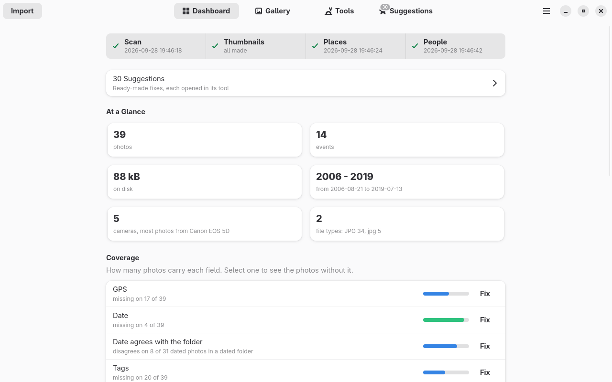

The first thing the application shows. Across the top, the **upkeep bar**: the scan, the
thumbnails, the place data and the people from Immich, each with a tick when it is fine, a warning
when it is worth running again, and when it last ran. Click one to see what its last run did and
to run it. Below it, how many ready-made fixes wait on the Suggestions tab, and what the library
holds.

### All the way down

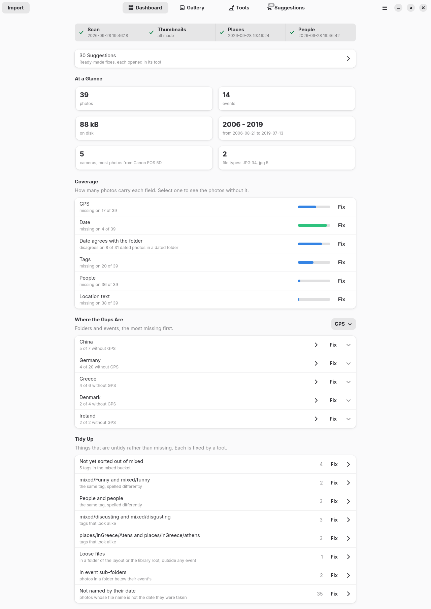

**Coverage** says how many photos carry each field - GPS, a date, a date that agrees with the
folder, tags, people, location text. **Where the Gaps Are** sorts the countries and their events by
what they miss of the field you pick. **Tidy Up** lists what is untidy rather than missing: tags
spelled two ways, tags that look alike, loose files, photos not named by their date. Every row
opens exactly the photos it counts, and **Fix** opens the tool or the group of fixes that mends
them.

## The gallery

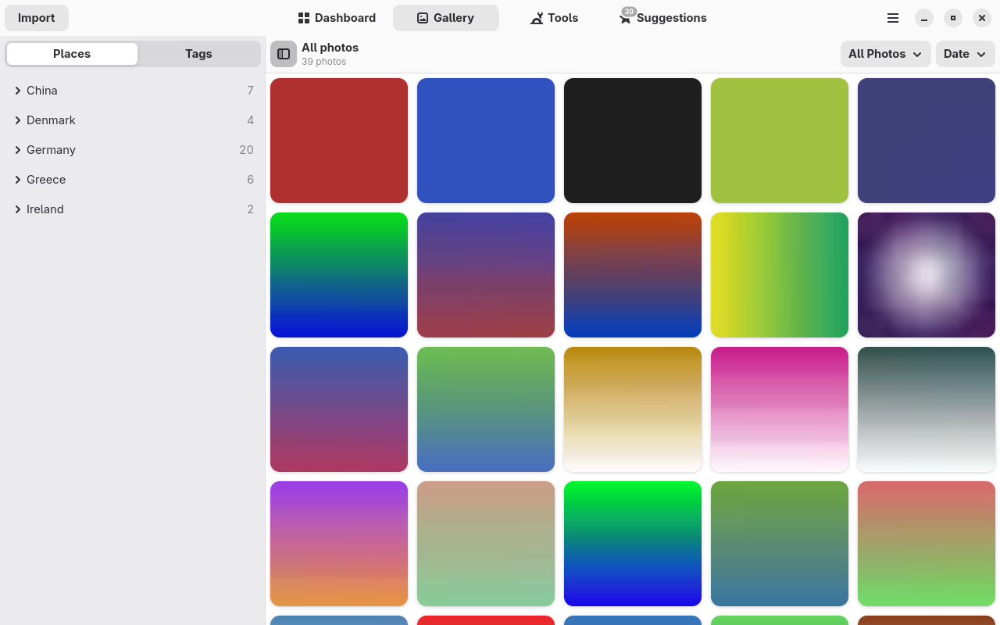

Countries and their events on the left, or the tag tree on the other tab; the photos on the right,
filtered by whatever the dashboard handed over, sorted by date or by name. Select some and they
become the scope a tool works on.

## One photo

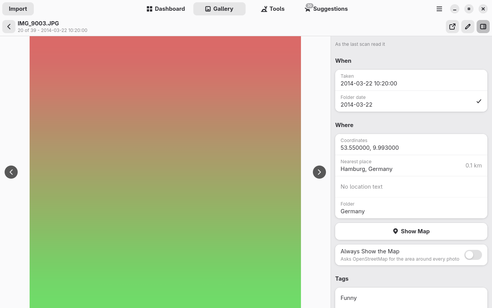

Everything the last scan read from the file, in one panel: when it was taken and whether that
agrees with the folder, where it was taken and the nearest town from the offline place data, its
tags and the people in it. The map is only fetched when you ask for it.

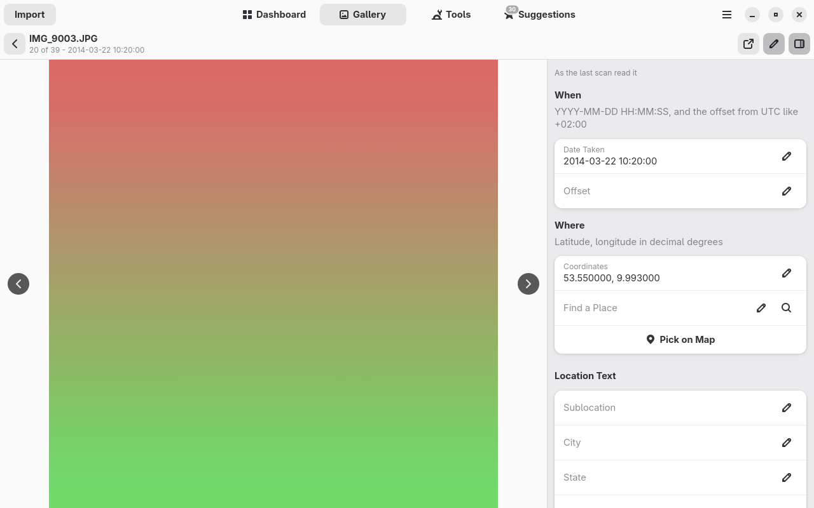

The pencil turns the panel into a form. Anything the bulk tools can write can be written to one
photo too, and it goes through the same preview and the same safe write.

## The tools

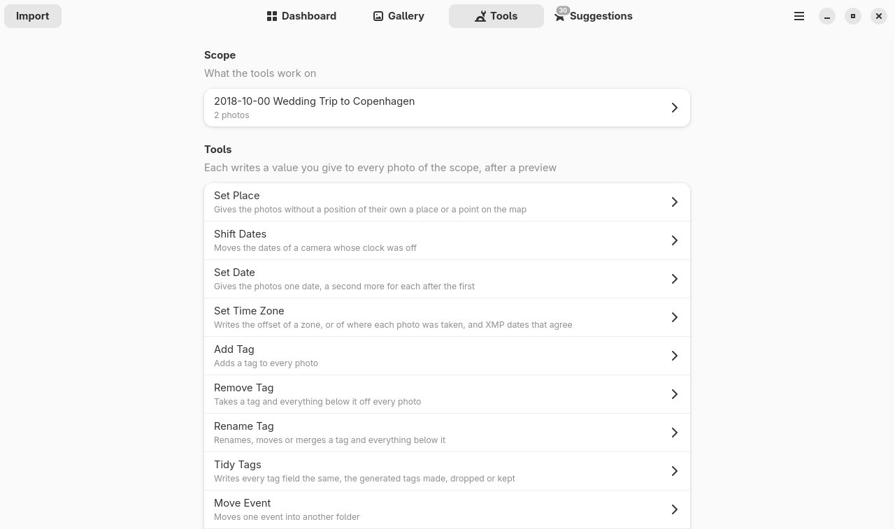

A tool writes one value you give it to every photo of the scope: a place, a shifted date, a time
zone, a tag, or a whole event moved into another folder. The scope is the library, the photos you
picked in the gallery, or one folder.

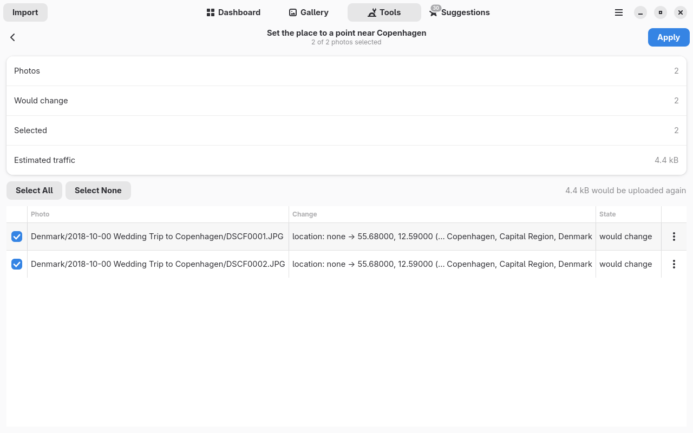

Nothing is written before this: the **preview** lists every photo, what it says now and what it
would say, and how much would be uploaded again to the cloud. Untick what you do not want, then
apply.

## Suggestions

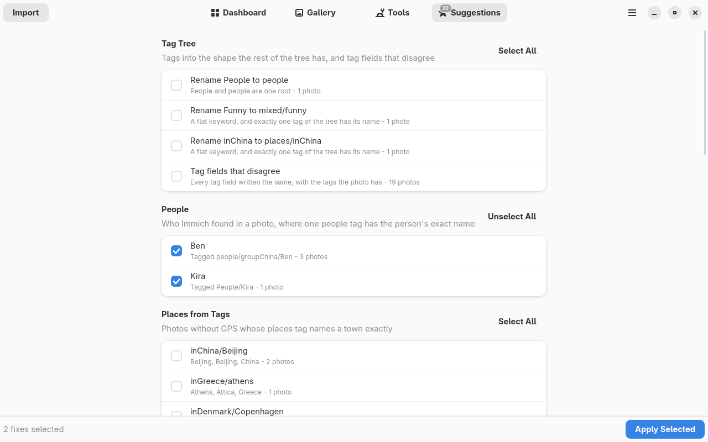

The fixes the application is sure of, in groups: tags into the shape the rest of the tree has,
people Immich recognised, places from a tag that names a town exactly, folders into the layout,
file names from the date. A ticked fix is its own preview - it says what it changes, and the tick
confirms it.

## Light and dark

  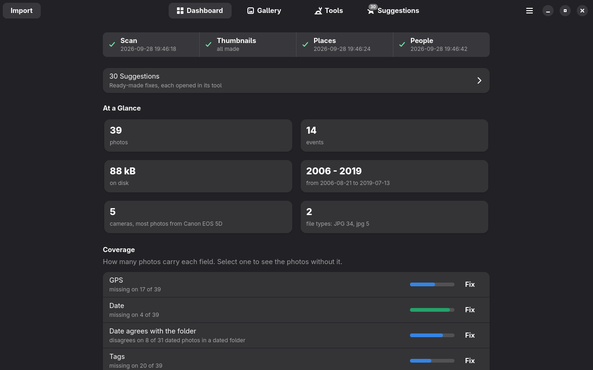
  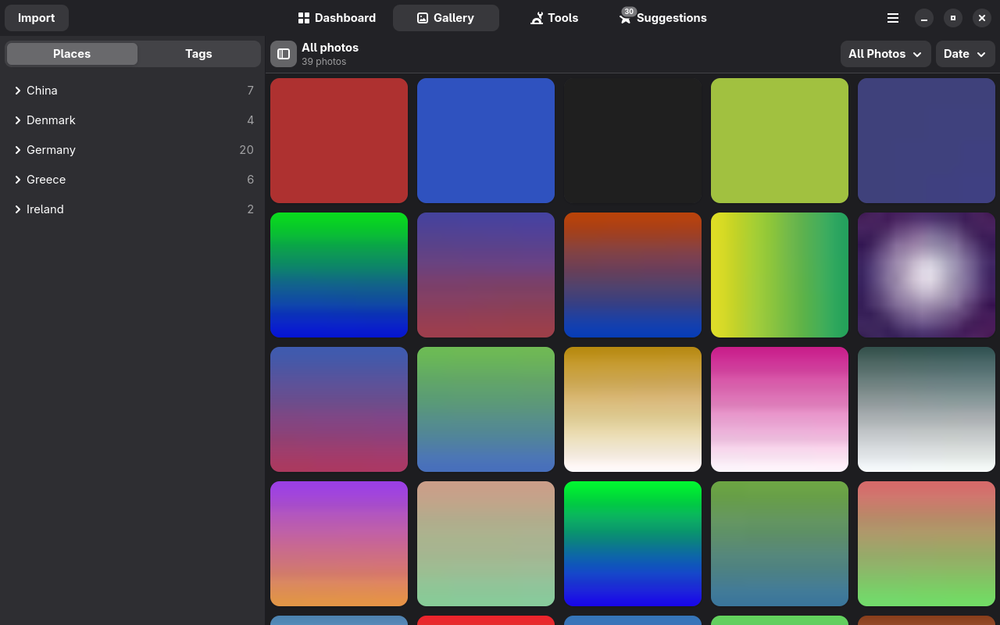

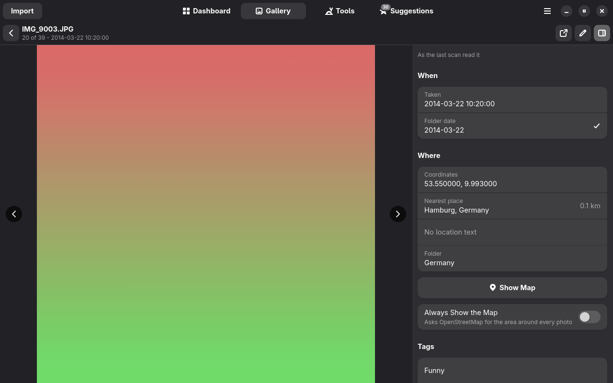

It follows the system's style, as every libadwaita application does.

## On a small screen

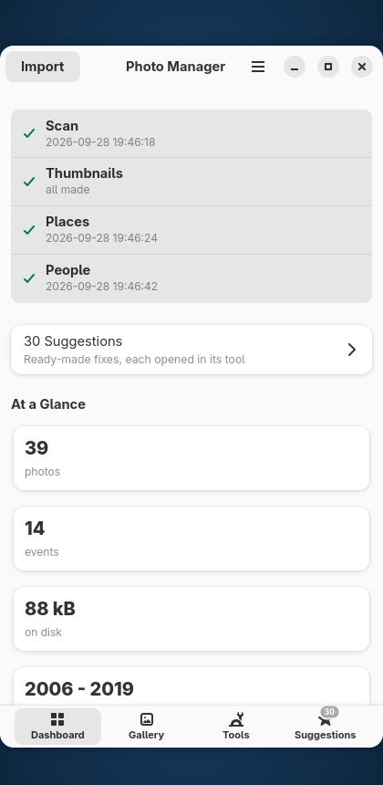

Narrow the window and the tabs move to the bottom, the upkeep bar becomes a column, and the cards
stack.
