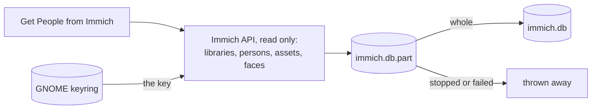
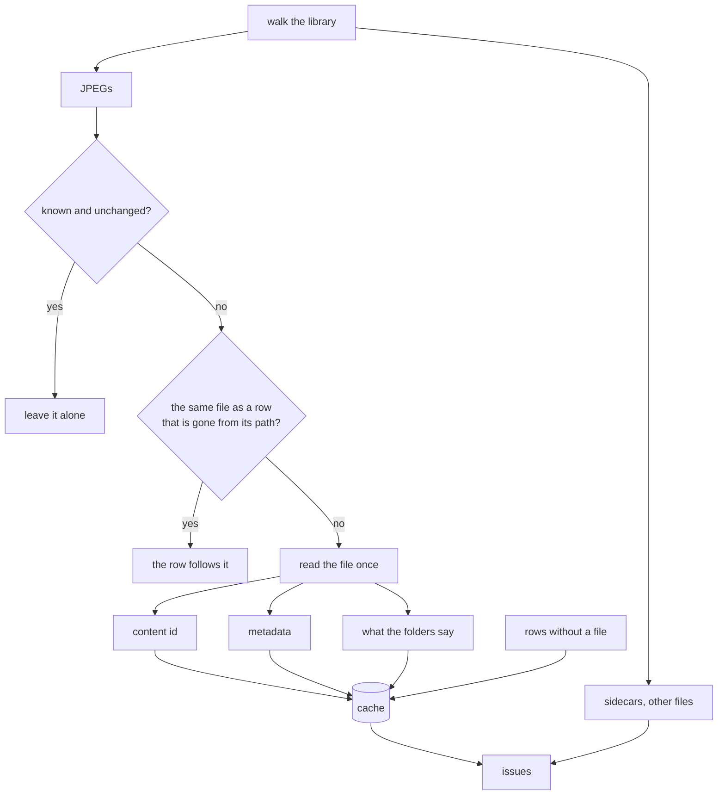
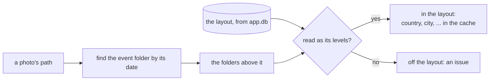

# The cache

The photos are the truth. The cache is what the application remembers about them so it does not
have to read the whole library every time it wants to answer a question. It can be deleted at any moment and
filled again from the files, and it is never the place where a piece of photo information only
exists.

It lives in `$XDG_CACHE_HOME/org.beijingcode.PhotoManager/cache.db` (SQLite, write-ahead log).

## What is in it

| Table | Holds |
|-------|-------|
| `photo` | one row per JPEG: where it is, what the filesystem says (size, mtime, inode), its content id, what the folders say (country, city, event date and name, the event's folder, sub-folder), what the metadata says (dates, GPS and how the position was worked out, the city in the location text, camera, orientation, rating, size, whether its tag fields are tidy, the face regions and persons it names), and the raw metadata as JSON |
| `tag` | one row per tag path per photo, from every tag field, plus its leaf |
| `issue` | one row per thing worth looking at, with its kind and a detail |

The raw JSON is there so a field we have not modelled yet is not lost between scans. It also
answers whether a photo says anything at all about its place in words, in any part and either
spelling, which a tool asks before it writes words that would take the photo's own away.

How the position was worked out is `GPSProcessingMethod` as the photo says it. One this
application wrote starts with `photoManager: `, which is how a position derived from a tag is told
apart from one a camera measured; the file carries the mark, the column only remembers it.

Because it holds what every photo says, the cache is also what answers "what would this change do
to these photos" without opening a single file, which is what a [preview](preview.md) is built
from, and what the [dashboard](dashboard.md) counts. The columns the dashboard asks about sit
together in one covering index, so counting them never reads the rows with their raw JSON.

## Tag fields

A photo keeps its tags in five fields, and older writers filled them differently: whole paths in
some, only the names in others, a level missing here and there, a tag in one field and not the
next. The scan reads all five. A photo's tags are every path of the three fields that hold paths,
and every name in the two flat fields that is no level of any path, so a tag written to one field
only is never lost.

It also remembers whether the fields are **tidy**, which is what a tag write leaves behind: every
path with all its levels in the three path fields, every level's name in the two flat ones, and
nothing in the label or the catalog sets, where older writers left keywords. A photo without any
tag and without those leftovers is tidy. A photo that is not needs a write even when its tags stay
the same, and the [tag vocabulary](tools.md#tag-vocabulary) is the tool that writes it.

A second, read-only connection can look at the cache while the application's own connection is
busy with a scan or an apply; that is how the dashboard is refreshed off the main thread.

## Face regions

A photo may say who is in it in two ways: MWG face regions, each a name and a box as a fraction of
the stored picture with the size it was measured against, and the IPTC persons. The scan keeps both
as the file lists them, so a change set can tell whether a photo already says what a
[people](tools.md#people-from-immich) write would, and a second run finds nothing. The preview
shows the names before and after, and when the names agree but a box, the size or the persons do
not, it says so after the names.

## What Immich knows

Next to the cache lies a second database, `immich.db`: what was last read from Immich about who is
in the photos. It holds Immich's persons, every photo Immich knows with where it lies inside the
library and how Immich saw its size and turn, and the face boxes of every photo a named person is
in. It is Immich's data, never ours: it is read only on the Get People from Immich button,
thrown away and read again at will, and a new one replaces the old only once it is whole. A read
that is stopped or fails keeps the one before. It has its own schema version, and one of another
version is no snapshot at all.

The answers given about it - which tag each person is - are not in it: they are the tool's
settings, next to the journal, and outlive every new read.

## Two ids

A photo is found by its **path**, which is what the filesystem hands out cheaply. It is
recognised by its **content id**: xxh3-128 over the JPEG image data with the metadata segments
left out. Writing metadata does not change it, moving or renaming the file does not change it,
re-encoding the image does. That is what makes a move visible as a move instead of a deletion
plus an addition, and it is what thumbnails and later tools key on.

## Scanning

Each file is read exactly once per scan; the same bytes feed the hasher, the metadata reader and
the [thumbnail](thumbnails.md) maker. Files are read on a worker pool, and one thread writes them to SQLite in batches of a
few hundred rows.

Unchanged means same size, same modification time and same inode. A second scan of an untouched
library reads no file at all and takes seconds.

A rename keeps all three, so a file at a new path that matches a row whose path is gone is that
row, renamed: the row follows it and what its folders say is read again from the new path, without
reading the file. A folder moved by the [Folder Migration](tools.md#folder-migration) or by hand
costs a scan nothing. A photo that was moved some other way - copied and deleted - is read again
and recognised by its content id.

There are two modes plus the rebuild:

- **Scan** looks at what changed and reads only that.
- **Rebuild** deletes the database and reads everything again. It asks first, and it never
  touches a photo.
- A scan can be cancelled; what was written stays, and the next scan continues from there.

Nothing scans on its own. A scan happens because someone pressed the button.

A photo the [write engine](writing.md) has changed has its cache row forgotten there and then, so
the next scan reads the file again rather than trusting a row that is now stale. A folder the engine
moved takes its rows with it at once, the same way a scan would. The journal of
those writes is a database of its own and is not part of the cache: a rebuild must not lose an
undo.

## Issues

An issue is a photo or a file worth looking at, not an error. They are computed during the scan
and live only in the cache:

| Kind | Means |
|------|-------|
| `no date` | the photo carries no date of its own |
| `off the layout` | the path is not in the [folder layout](#folder-names), or holds no event |
| `unreadable` | the file could not be read or its metadata not parsed |
| `not a photo` | a file in the library that is not a JPEG, or has no image data |
| `sidecar` | an `.xmp` file next to the photos |
| `duplicate content` | two files with the same image data |

They are what the tools in later phases work from, and the dashboard counts them.

## Folder names

A path is read against the **folder layout** the user chose in Preferences: the levels above the
event folder, from the top of the library down. The default is `Country/[City/]`, and a layout
can be put together from country, region, city, year, month and a tag under a chosen root, each
optional or not - `Year/Country/`, `Country/Year/`, `Topic/`, or no level at all. Below the
levels always comes the event folder, `YYYY-MM-DD Event name`, then any sub-folders.

The event folder is found by its date wherever it is, not by its depth, so an event is an event
in any layout. A date may have holes: `2006-09-00` is September 2006 without a day, `0000-00-00`
is an unknown date. The holes are kept as they are, never filled in with a guess. A year or
month level has to say the event's own year or month.

What the folders above the event say is read as the layout's levels. When they do not fit, the
event keeps its date and name and is **off the layout**; a file in a folder of the layout but in
no event is **loose**. A layout that could read one path in two ways - an optional country next
to an optional city, both plain names - is refused before it is kept.

The layout is a setting, not photo information, so it lives in `app.db`. The cache remembers
which layout its rows were placed with; when it changes, every row is placed again from its path,
without reading a file, and the issues follow. Nothing on disk moves - that is
[Folder Migration](tools.md#folder-migration).

