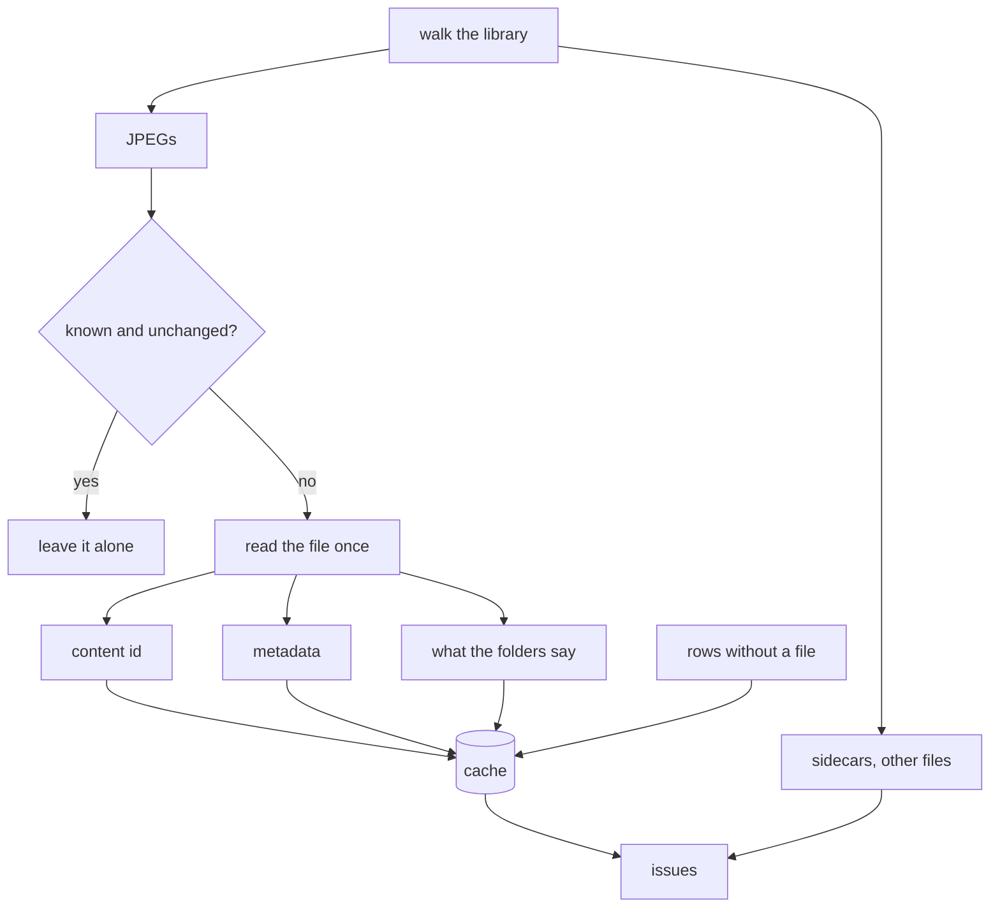

# The cache

The photos are the truth. The cache is what the application remembers about them so it does not
have to read 37 GB every time it wants to answer a question. It can be deleted at any moment and
filled again from the files, and it is never the place where a piece of photo information only
exists.

It lives in `$XDG_CACHE_HOME/org.beijingcode.PhotoManager/cache.db` (SQLite, write-ahead log).

## What is in it

| Table | Holds |
|-------|-------|
| `photo` | one row per JPEG: where it is, what the filesystem says (size, mtime, inode), its content id, what the folders say (country, city, event date and name, sub-folder), what the metadata says (dates, GPS, camera, orientation, rating, size), and the raw metadata as JSON |
| `tag` | one row per tag path per photo, plus its leaf |
| `issue` | one row per thing worth looking at, with its kind and a detail |

The raw JSON is there so a field we have not modelled yet is not lost between scans.

## Two ids

A photo is found by its **path**, which is what the filesystem hands out cheaply. It is
recognised by its **content id**: xxh3-128 over the JPEG image data with the metadata segments
left out. Writing metadata does not change it, moving or renaming the file does not change it,
re-encoding the image does. That is what makes a move visible as a move instead of a deletion
plus an addition, and it is what thumbnails and later tools key on.

## Scanning

Each file is read exactly once per scan; the same bytes feed the hasher, the metadata reader and
the [thumbnail](thumbnails.md) maker. Files are read on a worker pool, and one thread writes them to SQLite in batches of a
few hundred rows.

Unchanged means same size, same modification time and same inode. A second scan of an untouched
library reads no file at all and takes seconds.

There are two modes plus the rebuild:

- **Scan** looks at what changed and reads only that.
- **Rebuild** deletes the database and reads everything again. It asks first, and it never
  touches a photo.
- A scan can be cancelled; what was written stays, and the next scan continues from there.

Nothing scans on its own. A scan happens because someone pressed the button.

## Issues

An issue is a photo or a file worth looking at, not an error. They are computed during the scan
and live only in the cache:

| Kind | Means |
|------|-------|
| `no date` | the photo carries no date of its own |
| `off the convention` | the path is not `Country/[City/]YYYY-MM-DD Event/...` |
| `unreadable` | the file could not be read or its metadata not parsed |
| `not a photo` | a file in the library that is not a JPEG, or has no image data |
| `sidecar` | an `.xmp` file next to the photos |
| `duplicate content` | two files with the same image data |

They are what the tools in later phases work from, and the dashboard counts them.

## Folder names

`Country/[City/]YYYY-MM-DD Event name/[sub-folder/]file.jpg`. A date may have holes:
`2006-09-00` is September 2006 without a day, `0000-00-00` is an unknown date. The holes are
kept as they are, never filled in with a guess. What cannot be read this way becomes an issue
and keeps whatever part could be read, usually the country.
