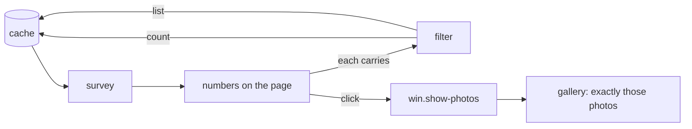

# Dashboard

The first thing the application shows: what the library holds, which fields its photos are
missing, where those gaps sit, and what is untidy. Every number that can be clicked shows exactly
the photos it counts.

## The survey

The page is filled from one **survey** of the [cache](cache.md), taken after every scan. Applying
or undoing a change set ends in a scan too, so a tool run shows up here as soon as it is read
back. The survey never opens a photo. It is taken off the main thread through a second, read-only
connection to the cache, so it can run while the cache itself is busy with something else.

| Part | Holds |
|------|-------|
| at a glance | photos, events, size on disk, the first and last date, cameras, file types as they are spelled |
| coverage | per field, how many photos could carry it and how many do not |
| where the gaps are | the same per country and per event, one field at a time, the most missing first |
| tidy up | things that are untidy rather than missing; a finding with nothing in it is not shown |

## What each field means

| Field | A photo is missing it when |
|-------|---------------------------|
| GPS | it has no latitude or no longitude |
| date | it carries no date of its own, the same test as the `no date` issue |
| date agrees with the folder | its date and its event folder's date are more than a day apart; only the parts the folder states count, so `2006-09-00` compares year and month. Photos without a date, or outside a folder with a year, are not counted either way |
| tags | it has no tag at all |
| people | it has no tag under a `people` root, whatever the case of the root |
| location text | no city in the IPTC or XMP location fields |

A day either side still agrees because photos taken after midnight, or with the camera still on
the time zone of home, are not wrong.

## Tidy up

- the photos still in the `mixed` bucket, and how many tags it holds,
- tags that are the same but for case (`people` and `People`), reported at the highest level only,
- sibling tags a letter or two apart (`funny` and `funyn`). This is a hint, not a verdict: short
  names and names that differ only in a number (`2006 Summer`, `2007 Summer`) are left out, and
  nothing looks further than one parent,
- loose files, photos in event sub-folders, and folders where an event should be but whose name
  has no date, each on its own because each is fixed by a different step of the folder migration,
- sidecars, files that are not photos, unreadable files and duplicate content, from the issues.

## Filters, and why a number cannot lie

Each number carries a **filter**: a small, closed description of a set of photos, optionally
narrowed to a folder. It has a written form, which is what a click hands to the
[gallery](gallery.md) and what tests and later suggestions use to name photos:

| Written | Means |
|---------|-------|
| `no-gps`, `no-date`, `date-off-folder`, `no-tag`, `no-people`, `no-location` | the photos missing that field |
| `no-gps@Germany`, `no-gps@Germany/2019-07-13 Sommerfest` | the same, inside a country or an event folder |
| `tag:mixed`, `tag:mixed/funny\|mixed/Funny` | photos with any of these tags or a tag below them, compared as spelled |
| `loose`, `sub-folder`, `off-convention` | the folder findings |
| `issue:sidecar`, `issue:duplicate content` | files with that issue |
| `all` | every photo |
| `no-gps+tag:people@Germany` | parts joined by `+` must all hold: here, photos tagged under `people` in that folder, without GPS |

A filter holds at most one part of each sort and writes them in a fixed order, so every filter
has exactly one written form. `tag:a|b` means either tag; `+` means both parts. A filter of one
part is written exactly as before parts could be combined, so every form the dashboard hands out
stays valid. Once one part is of files that may not be photos (loose files, an issue), the whole
set is asked of those files, and each photo part applies to the ones that are photos.

A click shows exactly those photos in the gallery, where the other controls can narrow them
further. A filter's count and its list of photos come from the same predicate, and the survey's grouped
counts use those predicates too. A test takes every number the survey produces and checks that its
filter lists exactly that many photos, over the stand-in library, and it has been checked the same
way over a copy of real photos.

## Staying fast

The survey asks only for columns that sit together in one covering index, so it never reads the
photo rows themselves with their raw metadata. Measured over a copy of a real library of thousands
of photos, it takes well under a tenth of a second in a release build.
