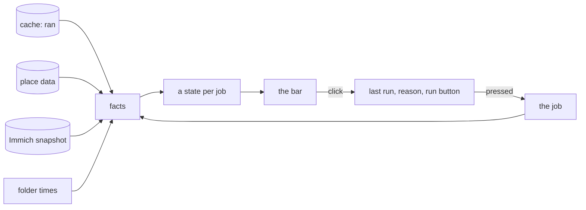
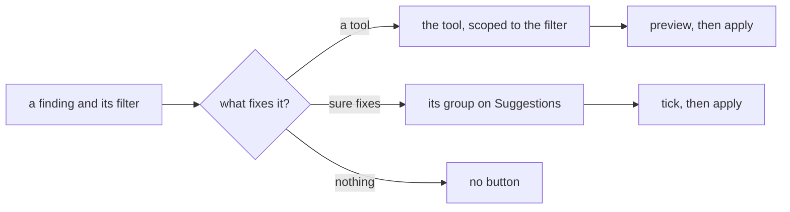
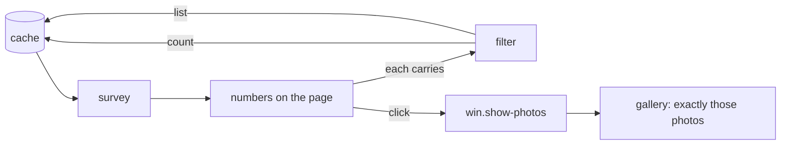

# Dashboard

The first thing the application shows: what the library holds, which fields its photos are
missing, where those gaps sit, and what is untidy. Every number that can be clicked shows exactly
the photos it counts.

## The upkeep bar

Across the top sits one bar with the four jobs that keep what the application knows next to the
photos in step: **Scan**, **Thumbnails**, **Places** and **People**. Each part shows the job's
state as an icon and, under its name, when it last ran or what is missing. Clicking a part opens
what the last run did, why it may be worth running again, and the button that runs it (Scan also
offers reading every photo again). The parts only show state; nothing runs until that button is
pressed, and no job ever runs on its own.

| State | When |
|-------|------|
| never run | nothing is known of a run |
| fine | the last run holds |
| worth running | see below |
| failed | the last run in this session did not work; the reason is in its popover |
| running | this job runs; the others wait, and a progress bar with Cancel sits under the bar |

A job is worth running again when:

| Job | Worth running when |
|-----|--------------------|
| Scan | the last scan was stopped; photos were written since; or a folder of the library changed after the scan began |
| Thumbnails | some photos have none |
| Places | the imported place data is more than a year old |
| People | the snapshot is more than 30 days old, or a scan found new photos after it was fetched |

Whether a folder changed is told from the folders alone: adding, removing or renaming a file
changes its folder's modification time, and a file written by ExifTool is replaced rather than
changed in place, so that shows too. No file is opened. It is looked at, off the main thread,
whenever the dashboard is shown and after every job. The times are kept in the
[cache](cache.md), the place data and the Immich snapshot, and shown in the computer's own time.

```mermaid
flowchart LR
    cache[(cache: ran)] --> facts
    geo[(place data)] --> facts
    snapshot[(Immich snapshot)] --> facts
    folders[folder times] --> facts
    facts --> state[a state per job]
    state --> bar[the bar]
    bar -- click --> popover[last run, reason, run button]
    popover -- pressed --> job[the job]
    job --> facts
```

On a narrow window the bar becomes a column.

## The survey

The page is filled from one **survey** of the [cache](cache.md), taken after every scan. Applying
a change set ends in a scan too, so a tool run shows up here as soon as it is read
back. The survey never opens a photo. It is taken off the main thread through a second, read-only
connection to the cache, so it can run while the cache itself is busy with something else.

| Part | Holds |
|------|-------|
| at a glance | photos, events, size on disk, the first and last date, cameras, file types as they are spelled |
| coverage | per field, how many photos could carry it and how many do not |
| where the gaps are | the same per top folder of the [layout](cache.md#folder-names) and per event, one field at a time, the most missing first |
| tidy up | things that are untidy rather than missing; a finding with nothing in it is not shown |

## What each field means

| Field | A photo is missing it when |
|-------|---------------------------|
| GPS | it has no latitude or no longitude |
| date | it carries no date of its own, the same test as the `no date` issue |
| date agrees with the folder | its date and its event folder's date are more than a day apart; only the parts the folder states count, so `2006-09-00` compares year and month. Photos without a date, or outside a folder with a year, are not counted either way |
| tags | it has no tag at all |
| people | it names no person, in a face region or in the IPTC persons; a `people` tag is a tag, not a person |
| location text | no city in the IPTC or XMP location fields |

A day either side still agrees because photos taken after midnight, or with the camera still on
the time zone of home, are not wrong.

Under GPS, a line counts the **events where a neighbour knows the position**: a photo in them
measured where it was, and others have a derived position or none. It counts events rather than
photos, so it opens a list instead of the gallery; each event in it opens
[Position from a Neighbour](tools.md#position-from-a-neighbour) on that event.

Under GPS too, **what is left for GPS** splits the photos without a position by what places them,
each part opening its fix, and the parts add up to the gap:

| Part | Holds | Fix opens |
|------|-------|-----------|
| a sure fix waits | photos Places from Tags or Places from Events places | the fixes |
| a tag the person answers | a places tag names a town the place data is not sure of | Set Place, scoped |
| the event decides | no town tag, in an event folder | Set Place, scoped |
| nothing to go on | no town tag, in no event | Set Place, scoped |

The split comes from the place check, which runs after every scan; while the check is older than
the photos it would not add up, and it is not shown.

## Tidy up

- the photos still in the `mixed` bucket, and how many tags it holds,
- tags that are the same but for case (`people` and `People`), reported at the highest level only,
- sibling tags a letter or two apart (`funny` and `funyn`). This is a hint, not a verdict: short
  names and names that differ only in a number (`2006 Summer`, `2007 Summer`) are left out, and
  nothing looks further than one parent,
- loose files, photos in event sub-folders, and folders where an event should be but whose name
  has no date, each on its own because each is fixed by a different step of the folder migration,
- photos not named by their date: a photo with a date whose file name is not one of the names
  the [File Names](suggestions.md#file-names) fix gives that date. It counts exactly the photos
  that fix would rename,
- sidecars, files that are not photos, unreadable files and duplicate content, from the issues,
- photos whose **places tag and position disagree**: the tag names a town more than 25 km - a
  town's width - from where the photo stands, or a country-only tag names another country than the
  one it stands in. A tag the place data is not sure of says nothing either way. This has to be
  empty before the places tags can go; its photos are shown, and the person decides which of the
  two is wrong.

These say what is untidy; how to fix it is the step after. While the Suggestions tab has any
fixes, a line at the top of the dashboard says how many and opens it
([suggestions.md](suggestions.md)).

## From a finding to its fix

The dashboard is also the check that the library keeps to its conventions: every way it breaks
them is a row here. A row shows its photos when clicked; a **Fix** button beside it opens where
those photos are fixed. What is fixed where is decided from the row's filter alone:

| Finding | Fix opens |
|---------|-----------|
| no GPS, no location text | Set Place, scoped to exactly those photos |
| no date | Set Date, scoped |
| date disagrees with the folder | Shift Dates, scoped |
| no tag | Add Tag, scoped |
| no people | the People fixes |
| `mixed`, case twins, tags that look alike | the Tag Tree fixes |
| loose files, sub-folders, off the layout | the Folders fixes |
| not named by their date | the File Names fixes |
| sidecars, not photos, unreadable, duplicate content | nothing: only a person can decide what goes |
| places tag and position disagree | nothing: only a person can say which is wrong |

A gap of one country or one event keeps its folder: Fix on the photos without GPS of one event
opens Set Place on that event's photos without GPS, and nothing else. A group of fixes is opened
on the Suggestions tab, scrolled to it; when nothing in it is sure right now, the tab says to use
the tools, which is where those photos are fixed by hand. A Fix never writes anything: the tool's
preview or the tick of a fix still comes first.

```mermaid
flowchart LR
    row[a finding and its filter] --> remedy{what fixes it?}
    remedy -- a tool --> tool[the tool, scoped to the filter]
    remedy -- sure fixes --> group[its group on Suggestions]
    remedy -- nothing --> none[no button]
    tool --> preview[preview, then apply]
    group --> tick[tick, then apply]
```

## Filters, and why a number cannot lie

Each number carries a **filter**: a small, closed description of a set of photos, optionally
narrowed to a folder. It has a written form, which is what a click hands to the
[gallery](gallery.md) and what tests and later suggestions use to name photos:

| Written | Means |
|---------|-------|
| `no-gps`, `no-date`, `date-off-folder`, `no-tag`, `no-people`, `no-location` | the photos missing that field |
| `no-gps@Germany`, `no-gps@Germany/2019-07-13 Sommerfest` | the same, inside a folder or an event folder |
| `tag:mixed`, `tag:mixed/funny\|mixed/Funny` | photos with any of these tags or a tag below them, compared as spelled |
| `person:Anna`, `person:Anna\|Ben` | photos naming any of these persons, with a face box or without, compared as spelled |
| `loose`, `sub-folder`, `off-layout` | the folder findings |
| `off-name` | the photos not named by their date |
| `issue:sidecar`, `issue:duplicate content` | files with that issue |
| `all` | every photo |
| `no-gps+tag:people@Germany` | parts joined by `+` must all hold: here, photos tagged under `people` in that folder, without GPS |

A filter holds at most one part of each sort and writes them in a fixed order, so every filter
has exactly one written form. `tag:a|b` means either tag; `+` means both parts. A filter of one
part is written exactly as before parts could be combined, so every form the dashboard hands out
stays valid. Once one part is of files that may not be photos (loose files, an issue), the whole
set is asked of those files, and each photo part applies to the ones that are photos.

```mermaid
flowchart LR
    cache[(cache)] --> survey
    survey --> numbers[numbers on the page]
    numbers -- each carries --> filter
    filter -- count --> cache
    filter -- list --> cache
    numbers -- click --> action[win.show-photos]
    action --> gallery[gallery: exactly those photos]
```

A click shows exactly those photos in the gallery, where the other controls can narrow them
further. A filter's count and its list of photos come from the same predicate, and the survey's grouped
counts use those predicates too. A test takes every number the survey produces and checks that its
filter lists exactly that many photos, over the stand-in library, and it has been checked the same
way over a copy of real photos.

## Staying fast

The survey asks only for columns that sit together in one covering index, so it never reads the
photo rows themselves with their raw metadata. The one exception is the names: the file name and
the date sit in no index together, so that finding reads the rows. Measured over a copy of a real
library of thousands of photos, the whole survey takes under a fifth of a second in a release
build, off the main thread.
