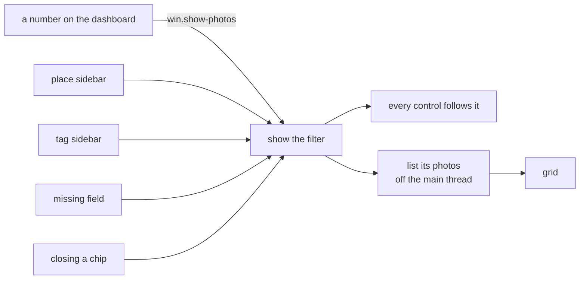
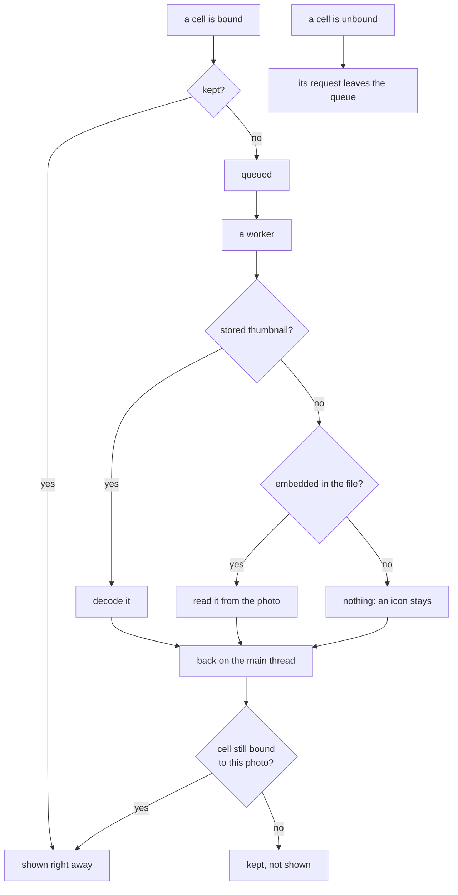

# Gallery

Where the photos a tool should work on are found. Pick a folder or an event, a tag, a field that
is missing, or any combination, and the grid shows exactly those photos. Select some or all of
them and hand them on as the **scope** of the next tool. Viewing is here to support finding, and
nothing on the grid writes. One photo opens on a [page of its own](photo.md).

## One filter, three controls

The page always shows one [filter](dashboard.md#filters-and-why-a-number-cannot-lie): a set of
parts that must all hold, optionally inside one folder. Each control owns exactly one part of it,
and every change, from a control or from a click on the dashboard, ends in the same place: the
filter is set, the controls follow it, the grid is filled again.

| Control | Owns | Written as |
|---------|------|------------|
| place sidebar | a top folder or an event folder | `@Germany`, `@Germany/2019-07-13 Sommerfest` |
| tag sidebar | one tag, everything below it included | `tag:people` |
| missing field dropdown | one gap, or none | `no-gps` |
| a chip | anything else the dashboard handed over: a folder finding, an issue, a pair of tags spelled alike | `loose`, `tag:mixed/funny\|mixed/Funny` |

So `no-gps+tag:people@Germany/2019-07-13 Sommerfest` is the photos of that event, tagged under
`people`, without GPS. Selecting the chosen place or tag again widens back; closing a chip takes
its part out and nothing else.

The sidebars count the photos of the whole library, not of the current filter, so the numbers do
not move while the other controls are changed. The place sidebar is the library's top folders -
countries, years or whatever the [folder layout](cache.md#folder-names) starts with - each with
the events below it; an event right in the library root is an entry of its own. It follows the
folders as they are on disk, so a library halfway into another layout shows both. A top folder's
count includes its loose photos, which belong to no event. Tags are shown as they are spelled: `People` and `people` are two roots, the
same way the filter tells them apart.

Photos are sorted by their own date, undated ones last, or by path, so an event reads in folder
order. A set in which no file is a photo, such as sidecars, is a plain list of paths instead of a
grid.

## The grid

The grid is virtualised: it keeps a few hundred cells, whatever the size of the set, and binds
them to photos as it scrolls. The whole library fits in it. Listing the photos of a filter asks
the [cache](cache.md) through its own read-only connection, off the main thread, and only the
answer to the newest question is shown.

## Pictures, loaded when a cell is bound

A cell asks for its picture when it is bound to a photo and lets go when it is unbound. Nothing is
loaded before that, and browsing never makes a thumbnail.

- A few workers read and decode off the main thread, in the order the cells were bound. The grid
  binds what is on screen first, so the screen comes first.
- A cell that is unbound takes its request back out of the queue. After a fast scroll, nothing is
  left waiting for cells that are long gone.
- Every bind starts a new generation for the cell. A picture that arrives for an older one is not
  shown, so a recycled cell never flashes the photo it showed before.
- The last few hundred pictures are kept, including the answer "there is none", and forgotten
  after a scan.

The stored thumbnail is the normal case: after a scan, every readable photo has one. The picture a
camera embeds in the file is only the placeholder for a photo that has none yet, and reading it
means opening the photo, read only. See [thumbnails.md](thumbnails.md).

Measured over a copy of a real library of thousands of photos, the whole library is listed and
put into the grid in a few tens of milliseconds, the first screen of pictures follows in about as
long again, and scrolling from end to end keeps pace with the screen.

## Opening a photo

Enter or a double-click on a cell opens the photo on a page pushed over the grid, in the same tab.
The page steps through this grid's list in this grid's order, and Back returns to the grid
scrolled to the photo that was open, with the filter, the order and the selection untouched. A
single click still only selects. What the page shows and how a photo is edited there:
[photo.md](photo.md).

## Selection and scope

Cells are selected with a click, Ctrl and Shift, a rubber band or Ctrl+A. While anything is
selected, a bar at the bottom says how many and offers Select All, Select None and **Use as
Scope**.

A **scope** is what the next tool works on. It is one of two things:

| Selection | Scope |
|-----------|-------|
| everything, or nothing | the filter itself |
| some of the photos | their paths, in grid order |

Keeping the filter rather than its paths means a scope over thousands of photos is a few words,
and it still means the right photos after a scan. It becomes the scope of the
[Tools](tools.md#the-scope) tab, and stays on offer there as the gallery's pick; the tab does not
switch. A scope only describes photos: a tool still goes through the change set, the
[preview](preview.md) and the confirmation before anything is written.

## Actions

| Action | Does |
|--------|------|
| `win.show-photos` | show a filter, named in its written form |
| `win.gallery-place` | choose a top folder or an event folder, or widen back from the chosen one |
| `win.gallery-tag` | choose a tag, or widen back from the chosen one |
| `win.gallery-gap` | set the missing field, a gap's key or `none` |
| `win.gallery-sort` | `date` or `name` |
| `win.gallery-select-all`, `win.gallery-select-none` | select every photo, or none |
| `win.use-as-scope` | make what is shown or selected the scope |
| `win.show-photo` | open one of the photos shown, by its path |
