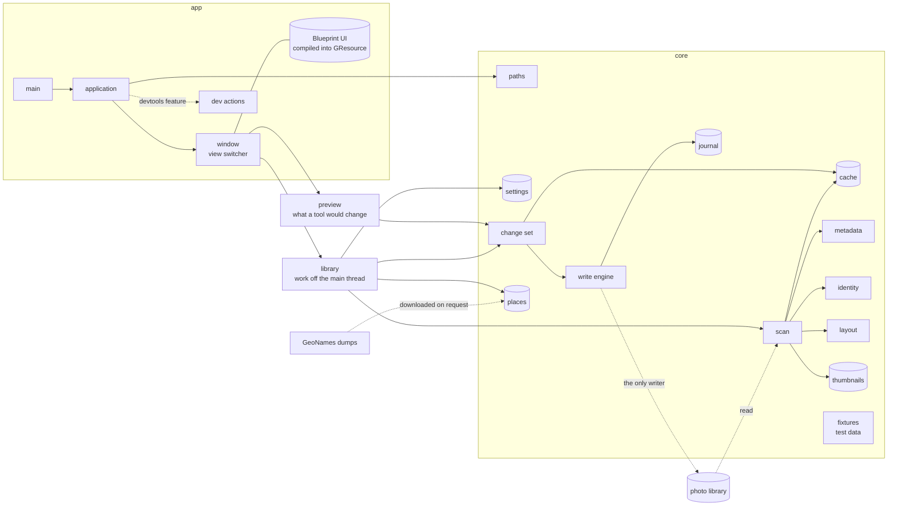

# Overview

photoManager is two crates in one cargo workspace.

`core` holds everything that does not need a display: where things live on disk, reading a
photo's metadata, identifying it by its image data, reading its folder names, the scan and the
cache it fills, the thumbnails, the place data, and the one engine that writes to a photo. It has
no GTK dependency, so it can be tested without a session. What the cache holds and how a scan
works: [cache.md](cache.md); the small pictures: [thumbnails.md](thumbnails.md); names and
coordinates: [places.md](places.md); changing what a photo says: [writing.md](writing.md).

The window reaches the write engine through one thing only: a change set, previewed and confirmed
before anything is written. How that works: [preview.md](preview.md).

`app` holds the GTK application: the window, its views, and the actions they expose. The user
interface is written in Blueprint, compiled to GtkBuilder XML by the build script and bundled
as a GResource, so the binary carries its own interface.

## Where data lives

| What | Where | Lifetime |
|------|-------|----------|
| photo library | `~/Nextcloud/Photos`, or `PHOTOMANAGER_LIBRARY` | the truth, never rewritten without a confirmed preview |
| cache | `$XDG_CACHE_HOME/org.beijingcode.PhotoManager` | disposable, rebuilt from the photos |
| thumbnails | `…/thumbs` in the cache | disposable, made again while scanning |
| GeoNames dumps | `…/geonames` in the cache | disposable, downloaded on request |
| place data | `$XDG_DATA_HOME/…/geo.db` | disposable, built from the dumps |
| journal of every write | `$XDG_DATA_HOME/…/app.db` | kept, never discarded: an undo has to outlive a cache rebuild |
| settings, presets | `$XDG_DATA_HOME/…/app.db`, next to the journal | kept, for the same reason |

Every location is resolved in one place, from the environment. Pointing `HOME`, `XDG_*` and
`PHOTOMANAGER_LIBRARY` somewhere else moves the whole application, which is how tests keep away
from real photos. In a debug build the application refuses to start when the library is not
there instead of creating one. `PHOTOMANAGER_GEONAMES` points at dumps that are already on the
machine, and then nothing is downloaded.

## Actions

The window and the application expose what they can do as actions, which is what menus,
shortcuts and tests all use:

| Action | Does |
|--------|------|
| `win.show-view` | show one of `dashboard`, `gallery`, `tools`, `suggestions` |
| `win.scan` | read what changed in the library into the cache |
| `win.fill-thumbnails` | make the thumbnails the scan could not make |
| `win.get-places` | fetch the GeoNames dumps and import them |
| `win.cancel-scan` | stop a running scan |
| `win.preview-select-all` | select every row of the preview that would change |
| `win.preview-select-none` | select none of them |
| `win.preview-details` | the exact tag-level diff of one row |
| `win.apply-change-set` | write the selected rows, after the first-write confirmation |
| `win.cancel-apply` | stop a running apply between photos |
| `win.undo-last` | take the last applied change set back, after confirmation |
| `app.rebuild-cache` | throw the cache away and read everything again, after confirmation |
| `app.about` | the about dialog |
| `app.quit` | quit |
| `app.dump-state` | write the current state as JSON (only with `devtools`) |
| `app.snapshot` | write the window as a PNG (only with `devtools`) |
| `win.preview-demo` | a change set without a tool behind it, to drive the preview (only with `devtools`) |

## Running and testing

`just build`, `just run`, `just check`. Tests come in three kinds:

- unit tests in `core`, no display needed,
- widget tests that build the window and drive its actions,
- a smoke test that starts the real binary in a private headless GNOME session, clicks through
  the view switcher and reads the state back.

The last two need a display of their own: `just test-ui` runs the suite inside a headless
session and `just smoke` drives the binary in one. `just fixture` writes a small stand-in
library with the shapes the real one has, and `just ui` opens the application on it.
