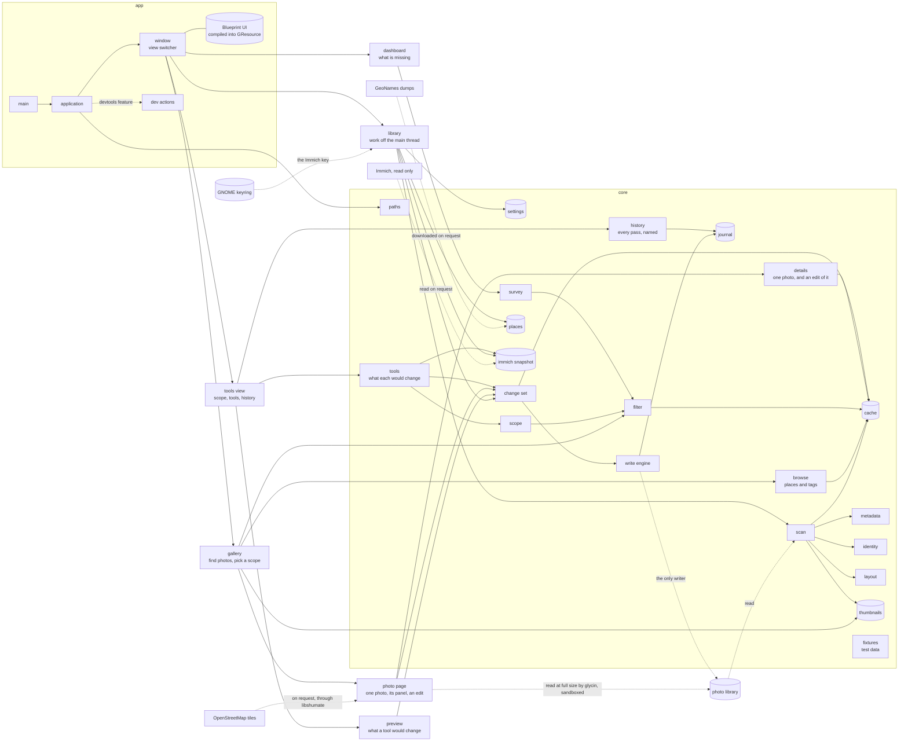

# Overview

photoManager is two crates in one cargo workspace.

`core` holds everything that does not need a display: where things live on disk, reading a
photo's metadata, identifying it by its image data, reading its folder names, the scan and the
cache it fills, the thumbnails, the place data, and the one engine that writes to a photo. It has
no GTK dependency, so it can be tested without a session. What the cache holds and how a scan
works: [cache.md](cache.md); the small pictures: [thumbnails.md](thumbnails.md); names and
coordinates: [places.md](places.md); changing what a photo says: [writing.md](writing.md); what
the library is missing, counted: [dashboard.md](dashboard.md); the places and tags a gallery
browses by, and the scope a tool is handed: [gallery.md](gallery.md); everything about one photo,
and the form one photo is edited in: [photo.md](photo.md).

The window reaches the write engine through one thing only: a change set, previewed and confirmed
before anything is written. How that works: [preview.md](preview.md). The tools that produce one,
the scope they work on and the history of every pass: [tools.md](tools.md).

`app` holds the GTK application: the window, its views, and the actions they expose. Two more
GNOME libraries serve the photo page: glycin decodes a photo at full size in its sandbox, and
libshumate draws a map. Three things use the network, each only when asked: getting the place
data, the map, and getting the people from Immich. Immich is only ever read: its address is kept
in the settings, and its API key in the GNOME keyring through the Secret Service, never in a file
of this application and never in a log. The user
interface is written in Blueprint, compiled to GtkBuilder XML by the build script and bundled
as a GResource, so the binary carries its own interface.

## Where data lives

| What | Where | Lifetime |
|------|-------|----------|
| photo library | `~/Nextcloud/Photos`, or `PHOTOMANAGER_LIBRARY` | the truth, never rewritten without a confirmed preview |
| cache | `$XDG_CACHE_HOME/org.beijingcode.PhotoManager` | disposable, rebuilt from the photos |
| thumbnails | `…/thumbs` in the cache | disposable, made again while scanning |
| GeoNames dumps | `…/geonames` in the cache | disposable, downloaded on request |
| what Immich knows about people | `…/immich.db` in the cache | disposable, fetched again on request |
| the Immich API key | the GNOME keyring | kept until replaced |
| place data | `$XDG_DATA_HOME/…/geo.db` | disposable, built from the dumps |
| journal of every write | `$XDG_DATA_HOME/…/app.db` | kept, never discarded: an undo has to outlive a cache rebuild |
| settings, presets, each tool's last settings and answers | `$XDG_DATA_HOME/…/app.db`, next to the journal | kept, for the same reason |

Every location is resolved in one place, from the environment. Pointing `HOME`, `XDG_*` and
`PHOTOMANAGER_LIBRARY` somewhere else moves the whole application, which is how tests keep away
from real photos. In a debug build the application refuses to start when the library is not
there instead of creating one. `PHOTOMANAGER_GEONAMES` points at dumps that are already on the
machine, and then nothing is downloaded.

## Actions

The window and the application expose what they can do as actions, which is what menus,
shortcuts and tests all use:

| Action | Does |
|--------|------|
| `win.show-view` | show one of `dashboard`, `gallery`, `tools`, `suggestions` |
| `win.show-photos` | hand a set of photos, named by a [filter](dashboard.md#filters-and-why-a-number-cannot-lie), to the gallery |
| `win.gallery-place`, `win.gallery-tag` | narrow the gallery to a folder or a tag, or widen back from the chosen one |
| `win.gallery-gap`, `win.gallery-sort` | the gallery's missing field and its order |
| `win.gallery-select-all`, `win.gallery-select-none` | select every photo in the gallery, or none |
| `win.use-as-scope` | make what the gallery shows or has selected the scope of the tools |
| `win.tools-scope` | set the scope: `all`, a country or event folder, or `picked` for the gallery's |
| `win.run-tool` | open a tool by its key, or `key:settings`, for the scope: its questions if it asks, else its change set in the preview; without settings, the ones it was last given |
| `win.answer` | answer one question: a tool, a question and `best`, `offer:N`, `leave`, `forget`, `choose` for the place search, `map` for the map, `shift`, `date` or `tag` to type one, or any answer as the settings write it |
| `win.answer-exact` | the tool's bulk button: Confirm Exact Matches, Confirm Where the Rest Is |
| `win.preview-answers` | the change set of the tool whose questions are shown, with the answers so far |
| `win.show-history` | the list of every pass |
| `win.history-details` | one pass and its photos, by batch |
| `win.undo-pass` | take back one pass by batch, after a confirmation that names the photos changed since |
| `win.scan` | read what changed in the library into the cache |
| `win.fill-thumbnails` | make the thumbnails the scan could not make |
| `win.get-places` | fetch the GeoNames dumps and import them |
| `win.get-people` | read the persons and their faces from Immich into the snapshot |
| `win.cancel-scan` | stop a running scan |
| `win.preview-select-all` | select every row of the preview that would change |
| `win.preview-select-none` | select none of them |
| `win.preview-details` | the exact tag-level diff of one row |
| `win.apply-change-set` | write the selected rows, after the first-write confirmation |
| `win.cancel-apply` | stop a running apply between photos |
| `win.undo-last` | take the last applied change set back, after confirmation |
| `win.show-photo` | open one of the gallery's photos on its own page |
| `win.photo-next`, `win.photo-previous`, `win.photo-first`, `win.photo-last` | step through the gallery's list |
| `win.photo-close`, `win.photo-panel`, `win.photo-open-with` | back to the grid, the panel, the system's image viewer |
| `win.photo-show-map` | the map around the photo, from OpenStreetMap |
| `win.photo-edit`, `win.photo-review`, `win.photo-apply` | edit one photo, review its exact change, write it |
| `app.preferences` | the Immich address, its API key and where the library lies inside it |
| `app.rebuild-cache` | throw the cache away and read everything again, after confirmation |
| `app.about` | the about dialog |
| `app.quit` | quit |
| `app.dump-state` | write the current state as JSON (only with `devtools`) |
| `app.snapshot` | write the window as a PNG (only with `devtools`) |
| `win.photo-form-rating` | pick a rating in the photo form, which a test cannot click (only with `devtools`) |
| `win.immich-key` | an Immich key for this run only, for a session without a keyring (only with `devtools`) |

## Running and testing

`just build`, `just run`, `just check`. Tests come in three kinds:

- unit tests in `core`, no display needed,
- widget tests that build the window and drive its actions,
- a smoke test that starts the real binary in a private headless GNOME session, clicks through
  the view switcher and reads the state back.

Nothing is ever tested against a real Immich: the tests serve a small one of their own, on a free
local port, with persons and faces over the stand-in library.

The last two need a display of their own: `just test-ui` runs the suite inside a headless
session and `just smoke` drives the binary in one. `just fixture` writes a small stand-in
library with the shapes the real one has, and `just ui` opens the application on it.
