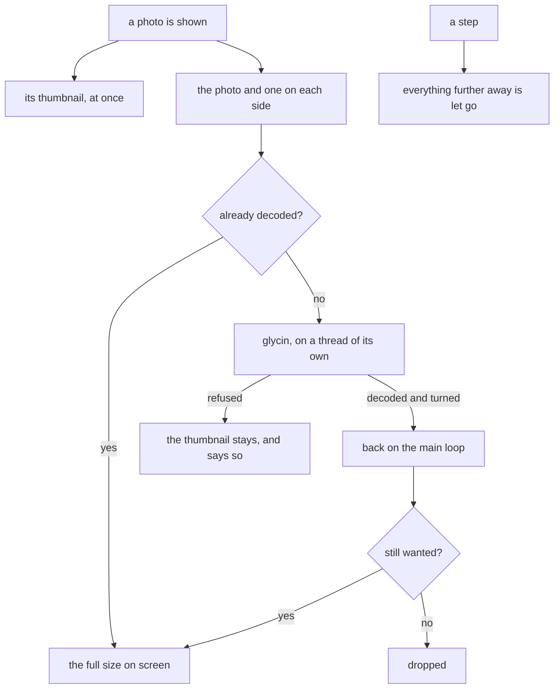
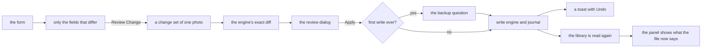

# The single photo

One photo, looked at closely: the picture as large as the window allows, everything the cache
knows about it beside it, and the fields the bulk tools will cover editable by hand. It is the
step between finding photos in the [gallery](gallery.md) and fixing them in bulk, and the first
place a person edits a photo, so the path to a write is the same as for a whole library.

## Opening and stepping

A photo opens on a page pushed over the gallery's grid, inside the Gallery tab: Enter or a
double-click on a cell. There is no second window. Back, or Escape, returns to the grid scrolled
to the photo that was open, with the filter, the order and the selection as they were.

The page walks the gallery's own list. The arrow keys step through exactly the photos of the
filter, in the order the grid shows them, so "no GPS in this event" can be gone through photo by
photo. Stepping past either end stays there.

| Key | Does |
|-----|------|
| Left, Page Up | the previous photo |
| Right, Page Down | the next photo |
| Home, End | the first and the last photo |
| Escape | back to the grid |
| F9 | show or hide the panel |

## The picture

The thumbnail is on screen at once: it comes from the gallery's loader, which usually still keeps
it. Then [glycin](https://gitlab.gnome.org/GNOME/glycin), the loader GNOME's own image viewer
uses, decodes the file in its sandbox, turns it by its orientation, applies its colour profile,
and the full size replaces the thumbnail. The picture fits the window; there is no zoom here, and
**Open in the Image Viewer** hands the file to the system's viewer for that.

- The photos on either side are decoded ahead, so a step shows the full size at once. Anything
  further away is let go: a full-size picture is tens of megabytes.
- glycin turns a photo by its orientation while it decodes, so the decode runs on a thread of its
  own and only the finished picture comes back. The window keeps answering, and no key press is
  lost while a large photo is on its way.
- A file glycin cannot read keeps its thumbnail with a banner saying the full size could not be
  read. Nothing else is tried in its place.

Measured over a folder of large real photos, straight from a camera: the thumbnail is on screen
at once, an upright photo is at full size in under a tenth of a second and one that has to be
turned in under half a second, a step onto a photo decoded ahead is instant, and holding the
arrow key through the folder keeps up with every press while no more than three pictures are
ever held.

## The panel

Beside the picture, the panel shows what the [cache](cache.md) knows about the photo, grouped the
way a person asks:

| Group | Shows |
|-------|-------|
| When | the date taken with its offset, the XMP date where it differs, the folder's date and whether the two agree, by the rule the dashboard counts with |
| Where | the coordinates, the nearest place, the location text, the place tags, the folder |
| Tags | the tag paths as a small tree, one branch per root |
| People | the names from `people` tags, either spelling of the root, and from face regions |
| Camera | make and model, dimensions, orientation, rating |
| File | the path, size, content id, when the file last changed, its issues |
| All Fields | every EXIF, IPTC and XMP field the scan read, filterable by name or value, selectable to copy |

Nothing in the panel opens the file. It is as fresh as the last scan and says so. The nearest
place comes from the local [place data](places.md), with no network. Under the breakpoint the
panel folds over the picture.

## The map, and the network

The map is the only thing on the page that asks a server for anything: OpenStreetMap's standard
layer, drawn by libshumate, with its attribution, for the area around the photo. It is made only
when **Show Map** is pressed, per photo, until **Always Show the Map** is switched on; that choice
is kept in `app.db`. A photo without coordinates shows no map. libshumate keeps the tiles it
fetched in its own cache.

So the network is used in two places in the whole application, and each only because a button
was pressed: getting the place data, and a map.

## Editing one photo

**Edit** turns the panel's When, Where, Tags and rating into a form:

| Field | Can be set by |
|-------|---------------|
| date and offset | typing, in the one date format and as `+HH:MM` |
| position | typing or pasting `latitude, longitude`, clicking on a map, or looking a place name up in the local place data |
| location text | typing the city, state, country, code and sublocation, or filling them from the nearest place |
| tags | removing one, or adding one, with suggestions from the library's tag tree, `people` tags included |
| rating | none, or zero to five |

Faces, camera fields, the file name and the folder are not editable here: faces come from Immich,
and the folders and names are the job of their own tools.

The form holds only text. What it means is decided in `core`, where it is tested without a
display: the date, the offset and the position are parsed and checked (a month 13, a latitude of
91, a longitude given first are refused with a reason), and only the fields that differ from what
the photo says become the change. A field emptied is a field taken away, and the review lists it
as a removal, so nothing is taken away unseen.

**Review Change** builds a [change set](preview.md) of this one photo and shows the exact
assignments the engine would make, every tag with what it says now and what it would say, and the
size of the file that goes up to Nextcloud again. Apply goes through the same gate as a whole
library: the backup question before the first write of all, the [write engine](writing.md) with
its proof that the image data did not change, the journal, and an undo one click away. The read
that follows every pass brings the panel up to date with what the file now says.

An unfinished edit is never dropped silently. Stepping to another photo, going back to the grid
or turning editing off with something changed asks first, and while editing the page cannot be
swiped away.

## Actions

| Action | Does |
|--------|------|
| `win.show-photo` | open a photo the gallery shows, by its path |
| `win.photo-next`, `win.photo-previous` | step through the gallery's list |
| `win.photo-first`, `win.photo-last` | the first and the last photo of it |
| `win.photo-close` | back to the grid, asking first about an unfinished edit |
| `win.photo-panel` | show or hide the panel |
| `win.photo-open-with` | hand the file to the system's image viewer |
| `win.photo-show-map` | show the map around the photo |
| `win.photo-edit` | start or stop editing |
| `win.photo-review` | the exact change of the form, in a dialog |
| `win.photo-apply` | write the reviewed change |
