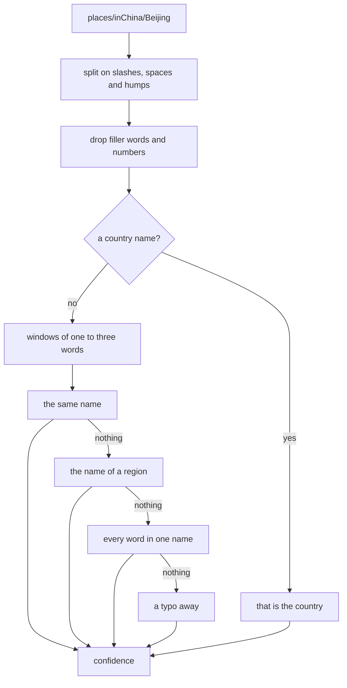

# Places

Half the library says where it was taken in words rather than in coordinates: a folder called
`Denmark`, a tag `places/inChina/Beijing`, an event called `Wedding Trip to Copenhagen`. The
other half has coordinates and no words. The place database turns each into the other, without
asking anyone on the internet.

It lives in `$XDG_DATA_HOME/org.beijingcode.PhotoManager/geo.db` and is built from the
[GeoNames](https://www.geonames.org/) dumps. Like every other database here it can be deleted
and built again. The data is CC BY 4.0; the attribution is in the About dialog and in
[NOTICE](../NOTICE).

## Getting the data

Nothing is downloaded on its own. **Get Place Data** on the dashboard fetches four files from
`download.geonames.org` into the cache directory and imports them:

| Dump | Holds |
|------|-------|
| `cities1000` | every populated place with a thousand people or more, with its alternate names |
| `admin1CodesASCII` | states, provinces and regions |
| `countryInfo` | the countries and their names |
| `shapes_simplified_low` | the outline of each country |

That is about 12 MB over the wire and about 93 MB on disk: 171,000 places, 920,000 names and
37,000 outline rings. The import takes a couple of seconds and replaces whatever was there
before; the date of the dumps is kept and shown next to the count.

`PHOTOMANAGER_GEONAMES` points at a directory that already holds the dumps, and then nothing is
downloaded at all. That is how the tests run offline, against a checked-in excerpt of a few
hundred rows.

## What is in it

| Table | Holds |
|-------|-------|
| `country`, `area` | countries and their first-level regions |
| `place` | one row per populated place: where it is, how big it is, what kind it is |
| `name` | every spelling of every place, folded to one comparable form |
| `name_search` | the same names in a full-text index |
| `place_at` | the coordinates of every place, in an R\*Tree |
| `ring`, `ring_at` | the country outlines, one row per ring, with a box around each |

Folding means lower case, no accents, no punctuation: `Zürich`, `zurich` and `ZURICH` are one
word, and so are `Straße` and `strasse`.

## From a name to a place

Each step runs only when the one before found nothing, so a good match is never diluted by a
worse one. The result is a list of candidates with a **confidence**, best first, and nothing
else: whether a candidate is good enough to write into a photo is decided by the tool that asked,
never here.

Confidence is mostly about how much of the text was matched. `Beijing` on its own comes out at
0.94; the same word inside `BeijingSeaSide` comes out at 0.53, because one word out of three is
not an answer. A country named in the text agrees or disagrees with the candidate and moves it
up or down. A typo costs; being a place people have heard of helps a little.

A region has no coordinates of its own in the dumps, so `Hainan` answers with the largest place
in Hainan and says that is what it did.

## From a place to a name

Coordinates go into the R\*Tree, which is widened in steps until something is near. The places
that come back are ranked by distance, discounted by how well known they are: a city of a
million wins from ten kilometres away against a village two kilometres away.

The **country** does not come from the nearest city, because the nearest city is often across a
border. It comes from the country outlines, by asking which outline the point falls inside, and
a point in a hole - Lesotho inside South Africa - is not inside.

The outlines are the simplified ones, which is worth knowing: within a couple of kilometres of a
border they are approximate, and around Basel they put a German town in Switzerland. In the
middle of a country they are right. A tool that asks for the country near a border should ask
the person too.
