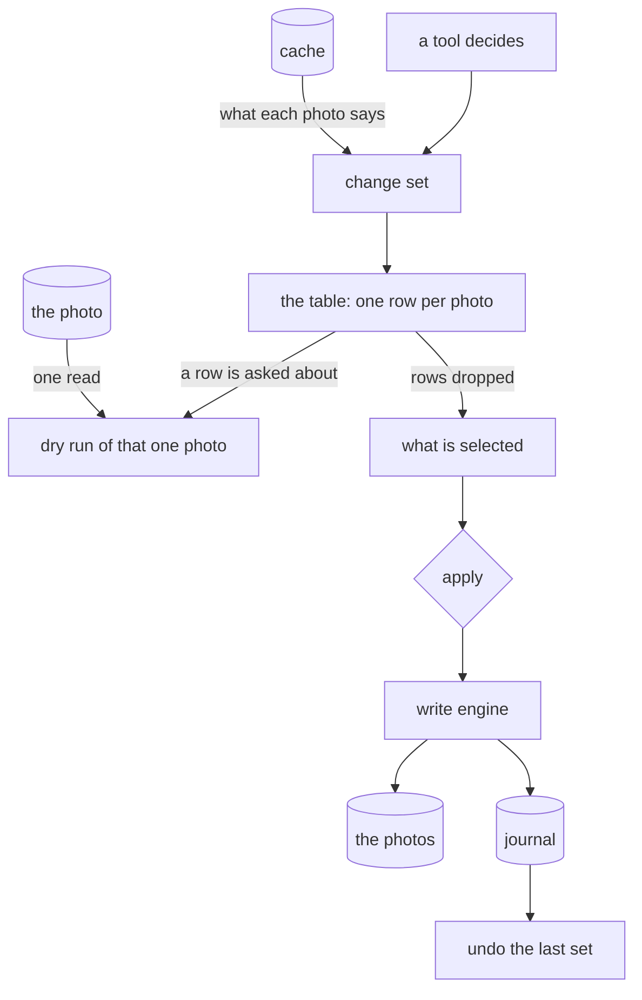

# Preview and apply

Nothing is written to a photo that the user has not seen first. A tool works out what it would
change, hands that over as a **change set**, and the change set is what reaches the screen, what
the user trims, and what is handed to the [write engine](writing.md) when they press apply. Every
tool inherits the preview, the traffic estimate, the confirmation and the undo by producing one.

The change set is the whole contract between a tool and the writing. No tool talks to the engine.

## A change set

One row per photo: where it is, what its image data was when the change was built, how big the file
is, what would change in words, and a verdict.

| Verdict | Means |
|---------|-------|
| would change | the photo does not say this yet, so it would be written |
| nothing to do | it already says it, as far as the cache knows |
| refused | it will not be touched, and why: not in the cache, unreadable, an intent that cannot be written |
| written / failed | what became of it once the set was applied |

Only a row that would change can be selected, and only selected rows are ever handed to the engine.

## Why the preview reads the cache and the apply reads the file

A pass over the whole library is one row per photo, and re-reading every photo with ExifTool to
build the preview would take a quarter of an hour. So a change set is built from the
[cache](cache.md) alone: a database query and some arithmetic, over thousands of photos in
milliseconds. Building one opens no photo and writes nothing at all.

That is safe because the safety does not depend on it. The engine re-reads and re-proves every
photo at apply time regardless - that is its job - so a row that has gone stale becomes a harmless
`skipped`, or a `refused` when the image data moved under us, and never a wrong write.

The cache does not keep everything a change can set. Where it cannot answer - a place in words, a
face region, a label being cleared - the row says so rather than guessing, and the verdict errs
towards "would change": over-estimating costs an estimate, under-estimating would silently drop a
photo the user wanted changed.

## Two levels of detail

A row says the change the way a person thinks about it - `location: none -> 39.90420, 116.40740` -
because nobody reads ten IPTC and XMP tags per photo across thousands of rows.

Asking about one row runs a **dry run** of that photo: the engine's own code path up to, and not
including, the journal. It costs one ExifTool read and returns every tag that write would set with
the value the tag has now. It is asked once per row and kept. The human summary is for scanning,
the exact detail is for checking, and the second is never a guess.

## What a pass costs

Nextcloud re-uploads the whole file for every edit, so the estimate is the sum of the file sizes of
the selected rows that would actually change - not a guess at the size of the difference. It is
shown in the summary and next to the apply button, so a pass over the library is a decision and not
a surprise.

## Before the first ever write

We cannot know that a backup exists, so the application asks instead of pretending to check. Before
anything is written for the first time - nothing acknowledged, nothing ever written according to
the journal - a dialog says plainly what is about to happen and requires an explicit
acknowledgement. It is recorded once, next to the journal in `app.db`, so it survives a cache
rebuild and is never asked again.

If the user names a backup location it is looked at: is it there, is anything in it, when was it
last changed. That is help for a person reading the dialog, and it is said in as many words that it
is not proof that their photos are in it.

## Applying

The selected rows are written as one journal batch, one photo after another, off the main thread.
Progress is shown in place, cancel stops between photos and leaves the journal consistent, and a
toast says what happened. Every row then carries its outcome, so the table shows what became of
each photo instead of what would have.

A written photo is forgotten by the cache - metadata changed, so what was remembered about it is
stale - and the library is read again afterwards. Reading is all that is: the photos are not
touched by it.

## Taking it back

The toast carries an undo, and so does the tools page. It is the last applied change set only, put
back through the engine and the journal that already do it, with its own confirmation. Once a batch
has been undone there is nothing left to take back, and the rows it touched are open to be applied
again - deselected, because taking a change back and putting it straight back on is never
accidental. The full history with per-batch undo comes with the tools view.

## One photo

A photo edited by hand on its [page](photo.md) is a change set of one row, built the same way from
the cache. It needs no table, so it is reviewed in a dialog instead: the exact assignments of that
one photo, from the same dry run a row's detail uses, and the size of the file that goes up again.
Apply writes it through the same backup question, engine, journal and undo; the two share the
questions, so a person is asked the same thing in the same words wherever the write comes from.
While a photo is open, the toast's Undo takes back the last applied change there.

## On screen

The tools view is a navigation stack. Its root is the list of tools; a tool that produces a change
set pushes the preview on top of it, and the back button returns. A preview only means anything
while a tool run is in flight, so it is not a view of its own.

The table is virtualised - a column view over a list model - because at one row per photo of the
whole library a widget per row would take seconds to build and hundreds of megabytes.
