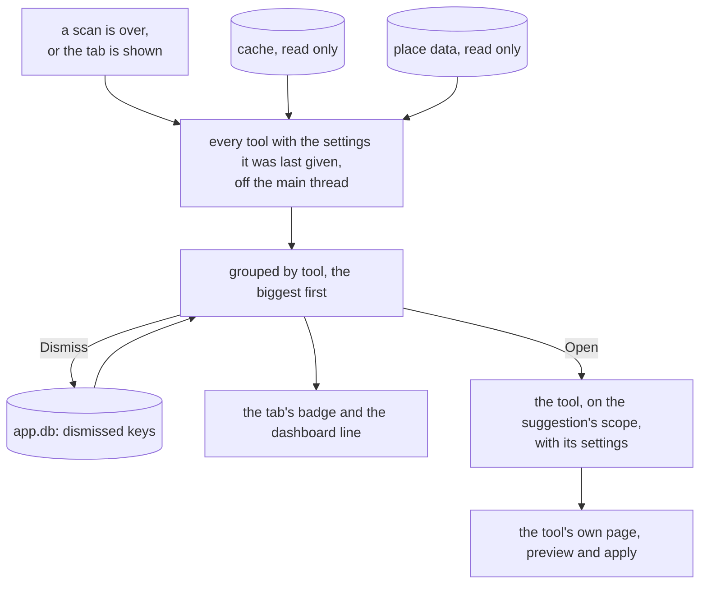
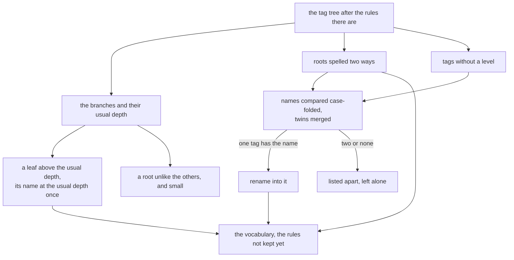

# Suggestions

The dashboard says what is missing; the Suggestions tab is the step after it: ready-made fixes the
tools found in the library on their own, each one click away from the tool that makes it. The app
sees what is off and says so, and the person clicks. Nothing is ever written from the tab itself.

## What a suggestion is

A suggestion belongs to a tool, the way a question does: `core` defines one shape, each tool
produces its own, and the window draws them without knowing which tool found what. It has

- a **key** that stays the same for as long as the same fix is found,
- a **title** and a **detail** in the tool's words, and the photos it is about,
- the **tool**, a **scope** and **settings**: exactly what opening it hands to the Tools page,
- whether it is **sure** - worked out to the end, so opening it and previewing is the whole fix -
  or only shows what was found and leaves the decision to the person,
- what it is made of, a line each: the rules it adds, the questions it would answer, the tags it
  leaves apart.

A tool without anything to say suggests nothing. A tool that asks suggests, without any code of
its own, the questions its bulk button would answer over the whole library: "6 tags match a
place by its exact name", "1 event has one sure folder". Opening it opens the tool's question page
on the whole library, where the bulk button does the rest. Its photo count is the one the preview
will show, so a photo two questions are about is counted once. A tool whose bulk button is empty,
such as the date tools, has no sure answers to suggest.

## The tab

The tools are asked off the main thread through read-only looks at the cache and the place data,
after every scan - and every write is followed by one - and whenever the tab is shown. A tool that
cannot say is left out, and the log says why. Only the newest asking is shown.

The list is grouped by tool, the tool with the most photos first, and each tool keeps its own
order inside its group. A suggestion made of rows opens to show them. The tab carries the number
of suggestions as a badge, and the dashboard has a line with the same number that opens the tab.

**Open** sets the scope of the Tools page to the suggestion's and opens its tool the way the list
would: its questions, its own page or its preview. The preview, the confirmation, the apply, the
journal and the take-back are the tool's, unchanged; a suggestion only saves the person from
finding the right tool, scope and settings.

**Dismiss** keeps the suggestion's key in `app.db`, next to the journal, so a dismissed suggestion
stays dismissed after a restart and a cache rebuild; the toast offers Undo. **Show Dismissed**
lists them again, each with **Restore**. A dismissed suggestion that is fixed disappears like any
other, and one that comes back with the same key stays dismissed.

## The shape of the tags

The first and biggest kind is the tag tree's. The Tag Vocabulary learns the shape the tags follow
from the tree itself - never from a list of roots in code, so a library with other roots works too
- and points at the tags that do not follow it. It looks at the tree after the rules there are, so
a fix already decided is not suggested again.

- **The branches** are the roots with tags below them, and for each how deep its leaves sit most
  often: `places/inGermany/Hamburg` makes `places` three levels deep, `timeline/2014` makes
  `timeline` two.
- **Roots spelled two ways** come first, `People` and `people` merged into the lower-case one,
  because merging them turns most of the next kind's doubtful cases into sure ones.
- **Flat keywords into their branch**: older files often carry only the flat keyword fields, which
  gives a tag without a level, `Anna` or `2014`. Where exactly one tag of the tree has its name -
  compared case-folded, and after the twins merge - it moves there: `Anna` into
  `people/family/Anna`, `inChina` into `places/inChina`. One suggestion for all of them, the rules
  listed inside.
- **Leaves at the wrong depth**, a city straight under `places` where the same name sits at the
  usual depth elsewhere in that branch, move there: `places/Hamburg` into
  `places/inGermany/Hamburg`.
- **Flat keywords that fit no one branch** are listed apart and left alone: one two tags have the
  name of, with both named, and one no tag has.
- **Roots that stand apart** - spelled in another case than most roots, and carried by far fewer
  photos than the biggest - are shown, never guessed at: rename or delete them on the Tag
  Vocabulary page.

A suggestion that adds rules opens the Tag Vocabulary with them added after the ones there are,
marked **not kept yet**, and a banner offers **Keep**. Preview keeps them too, and so does any
change made on the page, since a rule after them may build on them. Leaving the page without
either drops them. From there it is the vocabulary's own tree, preview, write and take-back
([tools.md](tools.md#tag-vocabulary)).

Measured over a copy of a real cache, asking every tool takes a couple of seconds off the main
thread, most of it the folder tool's questions.

## Not here

Applying anything: a suggestion always ends in its tool's preview. A "fix everything" button would
write without a preview the person confirmed. Showing a flat keyword in its branch in the gallery
before it is written would show what the files do not say.
