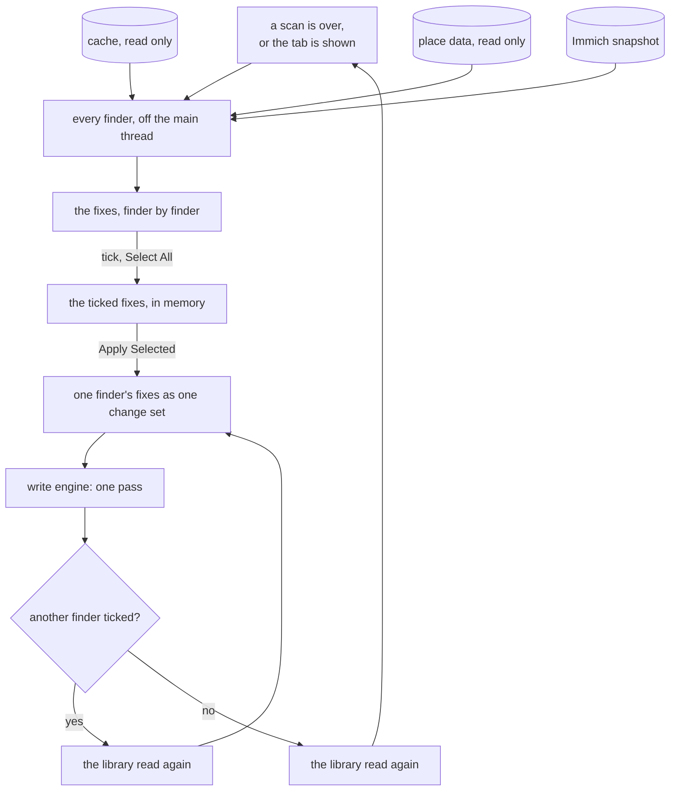
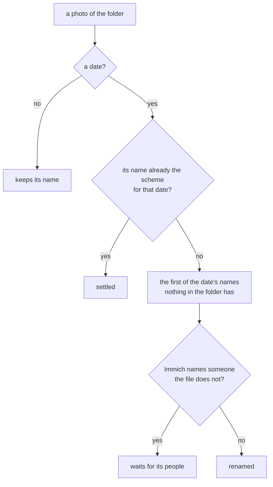

# Suggestions

The dashboard says what is missing; the Suggestions tab is what the app is sure it can fix on its
own. Each fix is small enough to tick or not on its own - one tag rule, one person, one places
tag, one event - and worked out to the end, so ticking it is the whole decision. **Apply Selected**
writes the ticked ones. What the app is not sure about is not here: it is done with the
[tools](tools.md), where the person gives the value.

## What a fix is

A fix belongs to a **finder**, and says what it is about, what it does, the photos it changes, and
where the title does not say it all, a line or two: the folder now and after. Nothing about a fix
is kept anywhere but whether it was [set aside](#set-aside). The list is found again after every scan - and every write is followed by one -
and a fix that was applied is gone because the photos now say it. A fix whose photos would all be
refused for good is no fix and is not listed.

| Finder | One fix is | Sure when |
|--------|------------|-----------|
| Tag Tree | one rename rule, or the tag fields that disagree | the shape of the tree leaves one place for the tag |
| Duplicate People | one person a photo names more than once | every box of the name lies on one face |
| People | one person Immich names | no other person in Immich has the name |
| Places from Tags | one places tag of photos without GPS | the place data knows the name exactly |
| Places from Events | one event with photos without GPS | every located photo of the event stands in one town |
| Events from Folders | one event folder whose photos do not name it in their own field | its folder has a name |
| Redundant Tags | the tags of one role whose field says them | the field is proved, tag by tag and photo by photo |
| Folders | one event off the folder layout, or renamed in its photos | every level of its folder is sure |
| File Names | one folder whose photos are not named by their date | the photo has a date |

## The tab

The fixes are grouped by finder, in the order they are applied, each group with **Select All**. The
dashboard's **Fix** on a finding opens the tab scrolled to the group that fixes it
([dashboard.md](dashboard.md#from-a-finding-to-its-fix)).
Each fix is a row with a check, its photo count, and its lines below it where it has any. The
checks live only in the window, in memory: a new list starts with none ticked, and a fix not
ticked is simply there again next time. The tab carries the number of fixes as a badge, and the
dashboard has a line with the same number that opens the tab.

**Apply Selected** writes the ticked fixes, finder by finder, in the order of the table above: each
finder one pass, and the library read again before the next one, so
each finder works on what the photos say now. The tags come before the people, and the people
before any folder moves, and the folder moves before the file names, so a photo is renamed in the
folder it ends up in. An event the people gate held back moves once its people are written
in the same apply. A fix that an earlier pass already made unnecessary changes nothing and is
skipped. The first write of all asks first whether the photos are backed up, like any apply
([preview.md](preview.md)); after that the ticks are the confirmation. Cancel stops after the pass
it came in. The toast says how many photos were written in how many passes and how many were
refused.

### Set aside

A fix the person does not want now, or one that keeps failing, would otherwise come back after
every apply, and the list would never empty. **Set Aside** on its row takes it out of the list:
it is never ticked, never applied, not counted in the badge or on the dashboard, and waits folded
under the groups, one row each with its finder and its current photo count. **Bring Back** puts it
back in its place. Neither asks first, since neither touches a photo.

Which fixes are set aside is a tool setting beside the others, not photo information: a list of
the fixes' keys, with the title each had and when it was set aside. A fix keeps its key for as long
as it is found, so it stays aside even when its photos change - an event that gains photos is still
the same fix, and the count in the fold shows the change. Whenever the list is found, a key no
longer found is dropped, so the fold only ever holds what is still there.

## Tag Tree

The finder learns the shape the tags follow from the tree itself - never from a list of roots in
code, so a library with other roots works too - and points at the tags that do not follow it. Each
becomes one rename, applied in the order found:

- **The branches** are the roots with tags below them, and for each how deep its leaves sit most
  often: `places/inGermany/Hamburg` makes `places` three levels deep, `timeline/2014` makes
  `timeline` two.
- **Roots spelled two ways** come first, `People` and `people` merged into the lower-case one,
  because merging them turns most of the next kind's doubtful cases into sure ones.
- **Flat keywords into their branch**: older files often carry only the flat keyword fields, which
  gives a tag without a level, `Anna` or `2014`. Where exactly one tag of the tree has its name -
  compared case-folded, and after the twins merge - it moves there.
- **Leaves at the wrong depth**, a city straight under `places` where the same name sits at the
  usual depth elsewhere in that branch, move there.
- **Tag fields that disagree**: the photos whose five tag fields do not say the same, written the
  same with the tags they have ([cache.md](cache.md#tag-fields)).

A flat keyword two tags have the name of, one no tag has, and a root that stands apart are not
sure, and are not found: they are renamed by hand with Rename Tag. Only the photos a rule changes
are written, with every level in every field; the generated tags are left as they are - Tidy Tags
is where they are made.

### Flat keywords

A library can choose [flat keywords](tools.md#tag-roles) for its topics - every tag of no role.
Then the shape of a topic's tree says nothing any more: the rules above are only found for the
roles, which keep their tree, and one fix more is offered while any topic is a path still:

- **Topics as flat keywords** writes each topic as its last level, `mixed/food` as `food`, on
  every photo that has one. Its lines name each root with how many keywords it holds, and every
  **merge**: two paths, or a path and a flat keyword, that end in the same name become one keyword.
  A merge is never silent: it is listed before anything is written, so one can be renamed first
  with Rename Tag. A root that is a home address or a place is the person's to move first, with
  Places Tag to Sublocation; the finder does not tell a place from a topic.
- Case twins and look-alikes are still found on the dashboard, among the flat names.

## Duplicate People

A person is in a photo once. A file can still name someone twice: a box drawn again on the same
face, or a name listed twice among the persons - what earlier writes of Immich's copies of a face
left behind. This finder names them once, before People runs, so People sees the files tidy. It
reads only what the files say; Immich plays no part. One fix per person.

- **Sure** is a name whose boxes in a photo all lie on one face: every two of them share at least
  half of the smaller. The largest box stays, as it is, and the others go; a name listed twice
  among the persons is listed once. Every other box and every other person stays as it was.
- **Left, with why:** a name with boxes on different faces - which one is the person is not the
  app's to guess - and a photo with a box without a name, which a write could not keep. They are
  a line on the person's fix; a person whose photos are all left is no fix.
- **What goes** is only ever a copy of a box that stays, so no one leaves a photo and no face
  loses its box.

## People

Immich knows who is in the photos: its face recognition found the faces and a person named them.
The files know it only where an older program drew a box or someone named a person by hand. This
finder writes what Immich knows into the files, so a photo moved or renamed later loses nothing
that only Immich knew. A person is a field of the photo of its own - the face regions and the
persons - not a tag: the `people` tags are neither read nor written here. Immich is only read,
never written.

- **What it reads.** The snapshot beside the cache, fetched with **Get People from Immich** on the
  dashboard ([cache.md](cache.md#what-immich-knows)): Immich's address is set in Preferences, its
  API key is kept in the GNOME keyring. A person without a name, or hidden, is never written.
- **Sure** is Immich's name, as it is, whatever the tags call the person. Two persons of one name
  in Immich are not sure, since the files could not tell them apart: their fix is listed as
  refused, with why, until one of them is renamed there. A person renamed in Immich and fetched
  again gets a new fix that renames them in the files.
- **What a photo gets.** Immich's faces of the ticked persons, merged into what the photo already
  says - never replacing it. A box the file has on the same face as one of Immich's (most of the
  smaller box covered) takes Immich's name and box; a box of the same name elsewhere in the photo
  gives way to Immich's too, as a person is in a photo once. Every other box stays exactly as it
  was, and so does every person the file names without a box. `PersonInImage` then names every
  box, then everyone without one. Nothing else is written: no tag, no date, no place.
- **A person once.** Immich may hold one face several times - its own detection and every import
  of the file's regions. A person gets one box, the largest of Immich's, and a box the file
  already has of them on the same face stays as it is: the person is written already.
- **One person at a time.** A photo of two persons gets the one ticked; the other stays for their
  own fix.
- **Two persons on one face.** When Immich names two persons on the same face, writing either
  would take the other's box, and the other's fix would take it back. That photo is refused for
  both persons, and their fixes count it as left, until it is set right in Immich and fetched
  again.
- **The boxes.** Immich measures a face on its preview, turned the way the photo is shown. The
  file wants the box on the stored picture, before any turn, so every box is turned back by the
  photo's orientation - each of the eight - and clamped to the picture, and the stored size is
  written with it.
- **Refused, with why.** A photo Immich has offline; one whose stored size or turn is not what
  Immich saw, or whose faces were measured on a picture of another shape, because its boxes would
  land somewhere else. A photo whose own boxes were measured on a picture of another shape, since
  the kept boxes and Immich's would not fit together, and one with a box without a name, which a
  write could not keep. A person whose photos all say it already, or are all refused, is no fix.
- **Immich afterwards.** A write changes a photo's modification time, so Immich reads it again on
  its next library scan and matches the faces to the old ones by where they are; a write that
  changes only metadata keeps every face on the same person. Immich's own face import is to stay
  off, or every person would be there twice.

## People from Tags

A `people` tag is often the only record that someone is in a photo: Immich found no face - a back
of a head, a face too small - or never learned the person. This finder gives the photos of such a
tag the person, in `PersonInImage`, without a box ([writing.md](writing.md#the-canonical-field-set)).
One fix per tag.

- **Sure** is a tag whose last level is, but for case, the name of one person the library knows:
  a person some photo names, with a box or without, or a named person of the Immich snapshot. Two
  known persons whose names differ only in case are not sure, and every other name, however near,
  is given by hand with [Tag to Person](tools.md#the-tags). Nothing is matched loosely.
- **A group** - a people tag with tags below it - is never a person.
- **What a photo gets.** The name, added to every name it has. A photo that names the person
  already, in any case, is left out. The tag stays: taking the tags away is a step of its own,
  once they say nothing the fields do not.

## Places from Tags

Photos without a position whose places tag names a town get that town's coordinates: one fix per
distinct deepest places tag, `places/inChina/Beijing`, not the `places/inChina` beside it.

- **Sure** is an exact name the place data gives 0.9 or more, looked for with the tag's country
  level as the hint. A typo, a region or a made-up place is not sure: Set Place gives it by hand.
- **A country alone** (`places/inChina`) is never a fix: a country centre is nowhere anyone took a
  photo.
- **What a photo gets.** The town's coordinates, marked in the file as derived from the tag and
  how far off they may be ([writing.md](writing.md#the-canonical-field-set)), and the town in words -
  but the words only when the photo has none, because writing a place takes away every part it
  does not set.
- **Two tags on one photo** that name two places are refused, with both named. A photo whose other
  tag is not sure waits, and is not counted in the fix.

## Places from Events

For the photos without a position the places tag cannot place: in an event folder, without a
places tag that names a town. One fix per event.

- **Where the rest of the event is.** The event's photos with a position each stand in a town,
  from the place data; a neighbourhood counts as its town. **Sure** is every located photo in the
  same town, and at least three of them. An event's name is never sure, however exact.
- **What a photo gets** is what the places tag gives, with this finder's mark in the file.

## Place Words from GPS

A photo with a position and no place in words at all - most often a camera or a phone that
measured it - gets the town, the state, the country and its code from the offline reverse lookup
([places.md](places.md)): the same words the tools write with a position they derive. One fix per
country, the towns it holds named.

- **Never over words.** A photo with any place word, in any part and either spelling, is left, as
  writing the words takes away every part not set.
- **A position with no town near** in the place data is left, and so is everything when there is
  no place data.

## Events from Folders

The event a photo belongs to goes into its own field, `Event`
([writing.md](writing.md#the-canonical-field-set)), so a photo that leaves its folder keeps it.
One fix per event folder: the name is the folder's name part as the layout reads it, without the
date - `2019-07-13 Summer Party` gives `Summer Party` - and a sub-folder's photos are its event's.

- **Never over another name.** A photo whose field names another event is refused with both names
  and left; the dashboard counts it under "event agrees with the folder".
- **A photo in no event folder** gets nothing.
- It runs before Folders, so an event renamed in its photos moves under its new name.

## Redundant Tags

Once a fact has a field of its own, the tag that repeats it can go
([tag roles](tools.md#tag-roles)). One fix per role that is not kept as tags, the tags it takes off
counted, and below it why the others stay, with how many photos each. Each deepest tag of the role
on each photo is proved on its own:

| Role | Proven when | Kept, with why |
|------|-------------|----------------|
| Year | the date's year is the tag's | no date; another year; not a year |
| Events | the event field names the tag's event, but for case, in the tag's year as the date or the folder says it | no event field; another event; another year |
| People | the photo names the tag's last level as a person, but for case | the photo does not name the person |
| Places, a town | the photo has a position, and its city word is the town or the town the place data is sure of lies within 25 km | no position; far from where it was taken; the place data is not sure of it |
| Places, a country | a position in that country | no position; another country |
| Places, finer | the sublocation is the tag's last level | (as a town, when not) |

A tag with levels below it is decided by them: a branch goes when every tag below it went. A tag of
no role is never touched. Ticking a fix writes each photo's tags without the proven ones, in every
tag field, and nothing else - no date, position, person or event is written here. The kept ones are
listed on the dashboard, per role, to be opened and fixed. It runs after every finder that writes a
field, so a tag whose field a fix of the same apply writes goes the next time.

## Folders

Every event of the library off the [folder layout](cache.md#folder-names), and every event whose
photos all name another event in their own field than its folder does, is looked at, level by
level, from what its photos already say: the country from its folders or places tags, the city
from the city folder it is in or the places tag of every photo, the region from that city, the
year and month from the event's date, a tag level from the one tag below its root every photo
carries. A city is spelled the way the library already spells it, so folders and tags agree.

- **The name** is the one the photos give, when all of them give the same one, else the folder's.
  So an event renamed with [Rename Event](tools.md#rename-event) is offered its folder under the
  new name, its date kept.
- **Sure** is a folder whose every level is sure. Several cities, a city on only some photos, an
  event without a year are not: Move Event moves them by hand.
- **The people gate.** An event whose photos Immich names people in that the files do not say is
  held back until they are written ([People](#people)); its fix says it waits, and ticking the
  people too lets it go in the same apply. A file says a person with a face region or in the
  persons of that name, in any case; a `people` tag says nobody. A move that is refused for good - its folder is there
  already, two events would go to one - is no fix.
- **One pass**: the moves are never written together with a change to a photo, and each moves an
  event with its sub-folders by one rename ([writing.md](writing.md#moving-a-folder)).

Measured over a copy of a real cache, finding every fix takes a few seconds off the main thread,
most of it the folders.

## File Names

Every photo is named by the moment it was taken, `YYYY-MM-DD_HHMMSS.jpg`, from the date in the
file as the camera's clock said it. No colon, because not every computer a synced library reaches
allows one, and the extension always `.jpg` in lower case. One fix per folder - an event, one of
its sub-folders, the loose photos of a country - and a photo never leaves its folder.

- **More photos in one second** are `_2`, `_3` and on, in the order of the fraction of the second
  the camera wrote, then of their old names. The first has the bare name.
- **Settled is never numbered again.** A name that is already one of the scheme's names for the
  photo's own date stays, whatever number it has. A photo added later takes the next free number,
  and nobody else moves; a second look at a renamed folder finds nothing.
- **No name anything in the folder has** is ever given, a photo or any other file, told apart
  without regard to case because a synced copy on another computer may not tell `a.jpg` from
  `A.jpg`. So a rename never waits on another one, two photos never swap names, and nothing can
  be overwritten; the engine refuses a target that is there all the same.
- **The people gate** holds a photo back as it holds an event: to Immich a renamed file is a new
  one, so the people go into the file first.
- **One pass of renames**, each a move of one photo inside its folder
  ([writing.md](writing.md#moving-a-folder)): not a byte of the photo changes, not even its
  modification time, and nothing is uploaded again.

Measured over a copy of a real library, every folder is found in well under a second, and renaming
thousands of photos takes about 11 ms each, most of it proving the image data before the rename.
Every file was the same file afterwards, and the scan after read none of them again.

## Not here

A choice between offers, a value typed, a pin on a map: that is the person's decision, made with a
tool. The list offers only what it is sure of, and never remembers a tick.
