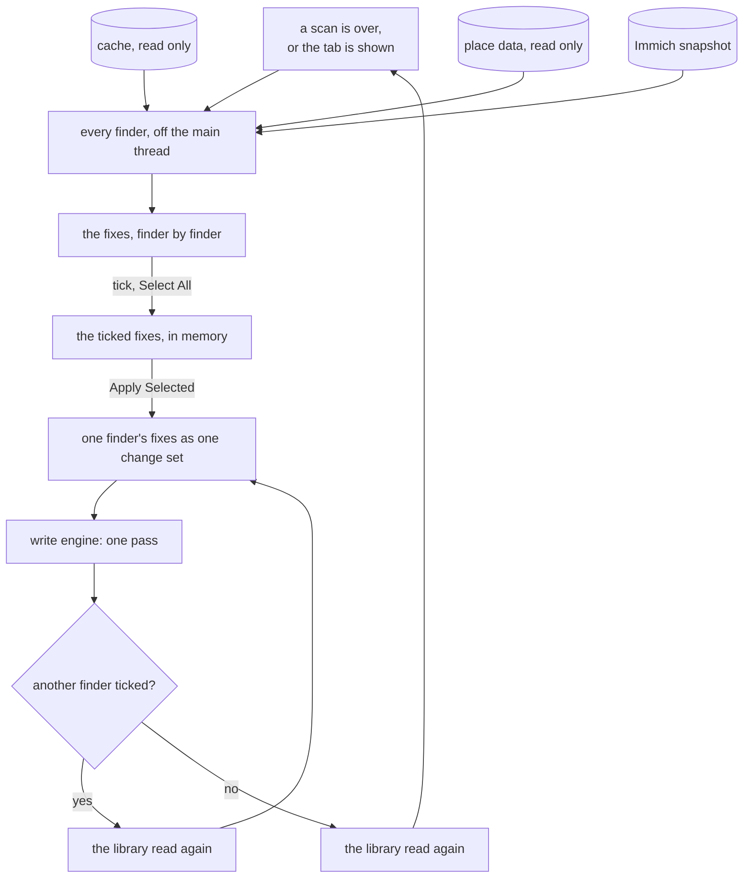
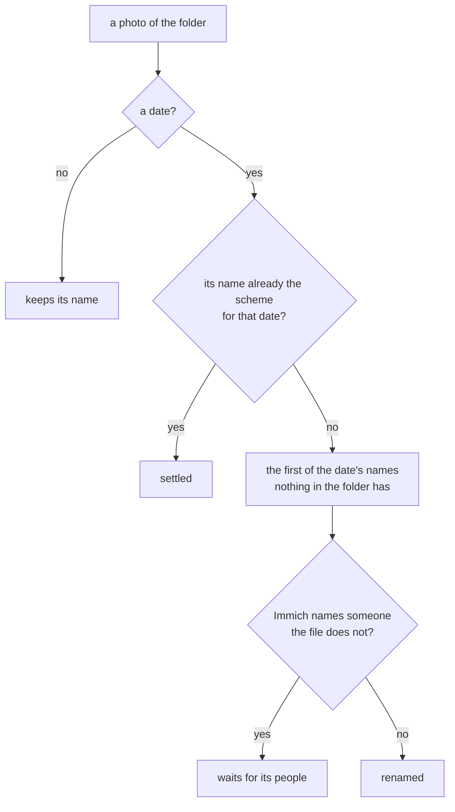

# Suggestions

The dashboard says what is missing; the Suggestions tab is what the app is sure it can fix on its
own. Each fix is small enough to tick or not on its own - one tag rule, one person, one places
tag, one event - and worked out to the end, so ticking it is the whole decision. **Apply Selected**
writes the ticked ones. What the app is not sure about is not here: it is done with the
[tools](tools.md), where the person gives the value.

## What a fix is

A fix belongs to a **finder**, and says what it is about, what it does, the photos it changes, and
where the title does not say it all, a line or two: the folder now and after. Nothing about a fix
is kept anywhere. The list is found again after every scan - and every write is followed by one -
and a fix that was applied is gone because the photos now say it. A fix whose photos would all be
refused for good is no fix and is not listed.

| Finder | One fix is | Sure when |
|--------|------------|-----------|
| Tag Tree | one rename rule, or the tag fields that disagree | the shape of the tree leaves one place for the tag |
| People | one person Immich names | exactly one people tag has the person's name |
| Places from Tags | one places tag of photos without GPS | the place data knows the name exactly |
| Places from Events | one event with photos without GPS | every located photo of the event stands in one town |
| Folders | one event off the folder layout | every level of its folder is sure |
| File Names | one folder whose photos are not named by their date | the photo has a date |

## The tab

The fixes are grouped by finder, in the order they are applied, each group with **Select All**. The
dashboard's **Fix** on a finding opens the tab scrolled to the group that fixes it
([dashboard.md](dashboard.md#from-a-finding-to-its-fix)).
Each fix is a row with a check, its photo count, and its lines below it where it has any. The
checks live only in the window, in memory: a new list starts with none ticked, and a fix not
ticked is simply there again next time. The tab carries the number of fixes as a badge, and the
dashboard has a line with the same number that opens the tab.

**Apply Selected** writes the ticked fixes, finder by finder, in the order of the table above: each
finder one pass, and the library read again before the next one, so
each finder works on what the photos say now. The tags come before the people, and the people
before any folder moves, and the folder moves before the file names, so a photo is renamed in the
folder it ends up in. An event the people gate held back moves once its people are written
in the same apply. A fix that an earlier pass already made unnecessary changes nothing and is
skipped. The first write of all asks first whether the photos are backed up, like any apply
([preview.md](preview.md)); after that the ticks are the confirmation. Cancel stops after the pass
it came in. The toast says how many photos were written in how many passes and how many were
refused.

## Tag Tree

The finder learns the shape the tags follow from the tree itself - never from a list of roots in
code, so a library with other roots works too - and points at the tags that do not follow it. Each
becomes one rename, applied in the order found:

- **The branches** are the roots with tags below them, and for each how deep its leaves sit most
  often: `places/inGermany/Hamburg` makes `places` three levels deep, `timeline/2014` makes
  `timeline` two.
- **Roots spelled two ways** come first, `People` and `people` merged into the lower-case one,
  because merging them turns most of the next kind's doubtful cases into sure ones.
- **Flat keywords into their branch**: older files often carry only the flat keyword fields, which
  gives a tag without a level, `Anna` or `2014`. Where exactly one tag of the tree has its name -
  compared case-folded, and after the twins merge - it moves there.
- **Leaves at the wrong depth**, a city straight under `places` where the same name sits at the
  usual depth elsewhere in that branch, move there.
- **Tag fields that disagree**: the photos whose five tag fields do not say the same, written the
  same with the tags they have ([cache.md](cache.md#tag-fields)).

A flat keyword two tags have the name of, one no tag has, and a root that stands apart are not
sure, and are not found: they are renamed by hand with Rename Tag. Only the photos a rule changes
are written, with every level in every field; the generated tags are left as they are - Tidy Tags
is where they are made.

## People

Immich knows who is in the photos: its face recognition found the faces and a person named them.
The files know it only where someone tagged a person by hand. This finder writes what Immich knows
into the files, so a photo moved or renamed later loses nothing that only Immich knew. Immich is
only read, never written.

- **What it reads.** The snapshot beside the cache, fetched with **Get People from Immich** on the
  dashboard ([cache.md](cache.md#what-immich-knows)): Immich's address is set in Preferences, its
  API key is kept in the GNOME keyring. A person without a name, or hidden, is never written.
- **Sure** is one tag of the people tree with the person's exact name, in either spelling of the
  root. Two tags of that name, or a name that is only near one, are not sure: rename the tag or
  the person in Immich until they agree.
- **What a photo gets.** A face region for the person, named with the last level of the person's
  tag; the person named in `PersonInImage`; and the tag in all five tag fields with every level.
  What it carried stays: a tag is only added. The region list is replaced as a whole, so Immich
  decides the faces.
- **The boxes.** Immich measures a face on its preview, turned the way the photo is shown. The
  file wants the box on the stored picture, before any turn, so every box is turned back by the
  photo's orientation - each of the eight - and clamped to the picture, and the stored size is
  written with it.
- **Refused, with why.** A photo Immich has offline; one whose stored size or turn is not what
  Immich saw, or whose faces were measured on a picture of another shape, because its boxes would
  land somewhere else. A person whose photos all say it already, or are all refused, is no fix.
- **Immich afterwards.** A write changes a photo's modification time, so Immich reads it again on
  its next library scan and matches the faces to the old ones by where they are; a write that
  changes only metadata keeps every face on the same person. Immich's own face import is to stay
  off, or every person would be there twice.

## Places from Tags

Photos without a position whose places tag names a town get that town's coordinates: one fix per
distinct deepest places tag, `places/inChina/Beijing`, not the `places/inChina` beside it.

- **Sure** is an exact name the place data gives 0.9 or more, looked for with the tag's country
  level as the hint. A typo, a region or a made-up place is not sure: Set Place gives it by hand.
- **A country alone** (`places/inChina`) is never a fix: a country centre is nowhere anyone took a
  photo.
- **What a photo gets.** The town's coordinates, marked in the file as derived from the tag and
  how far off they may be ([writing.md](writing.md#the-canonical-field-set)), and the town in words -
  but the words only when the photo has none, because writing a place takes away every part it
  does not set.
- **Two tags on one photo** that name two places are refused, with both named. A photo whose other
  tag is not sure waits, and is not counted in the fix.

## Places from Events

For the photos without a position the places tag cannot place: in an event folder, without a
places tag that names a town. One fix per event.

- **Where the rest of the event is.** The event's photos with a position each stand in a town,
  from the place data; a neighbourhood counts as its town. **Sure** is every located photo in the
  same town, and at least three of them. An event's name is never sure, however exact.
- **What a photo gets** is what the places tag gives, with this finder's mark in the file.

## Folders

Every event of the library off the [folder layout](cache.md#folder-names) is looked at, level by
level, from what its photos already say: the country from its folders or places tags, the city
from the city folder it is in or the places tag of every photo, the region from that city, the
year and month from the event's date, a tag level from the one tag below its root every photo
carries. A city is spelled the way the library already spells it, so folders and tags agree.

- **Sure** is a folder whose every level is sure. Several cities, a city on only some photos, an
  event without a year are not: Move Event moves them by hand.
- **The people gate.** An event whose photos Immich names people in that the files do not say is
  held back until they are written ([People](#people)); its fix says it waits, and ticking the
  people too lets it go in the same apply. A move that is refused for good - its folder is there
  already, two events would go to one - is no fix.
- **One pass**: the moves are never written together with a change to a photo, and each moves an
  event with its sub-folders by one rename ([writing.md](writing.md#moving-a-folder)).

Measured over a copy of a real cache, finding every fix takes a few seconds off the main thread,
most of it the folders.

## File Names

Every photo is named by the moment it was taken, `YYYY-MM-DD_HHMMSS.jpg`, from the date in the
file as the camera's clock said it. No colon, because not every computer a synced library reaches
allows one, and the extension always `.jpg` in lower case. One fix per folder - an event, one of
its sub-folders, the loose photos of a country - and a photo never leaves its folder.

- **More photos in one second** are `_2`, `_3` and on, in the order of the fraction of the second
  the camera wrote, then of their old names. The first has the bare name.
- **Settled is never numbered again.** A name that is already one of the scheme's names for the
  photo's own date stays, whatever number it has. A photo added later takes the next free number,
  and nobody else moves; a second look at a renamed folder finds nothing.
- **No name anything in the folder has** is ever given, a photo or any other file, told apart
  without regard to case because a synced copy on another computer may not tell `a.jpg` from
  `A.jpg`. So a rename never waits on another one, two photos never swap names, and nothing can
  be overwritten; the engine refuses a target that is there all the same.
- **The people gate** holds a photo back as it holds an event: to Immich a renamed file is a new
  one, so the people go into the file first.
- **One pass of renames**, each a move of one photo inside its folder
  ([writing.md](writing.md#moving-a-folder)): not a byte of the photo changes, not even its
  modification time, and nothing is uploaded again.

Measured over a copy of a real library, every folder is found in well under a second, and renaming
thousands of photos takes about 11 ms each, most of it proving the image data before the rename.
Every file was the same file afterwards, and the scan after read none of them again.

## Not here

A choice between offers, a value typed, a pin on a map: that is the person's decision, made with a
tool. The list offers only what it is sure of, and never remembers a tick.
