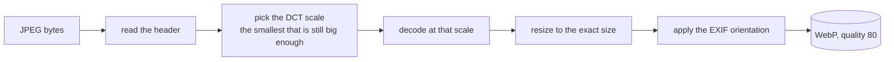

# Thumbnails

A grid of seventeen thousand photos cannot open seventeen thousand JPEGs. The thumbnail store
holds one small picture per photo, made once and read many times. Like the cache it is
disposable: delete it and the next scan makes it again.

It lives in `$XDG_CACHE_HOME/org.beijingcode.PhotoManager/thumbs`.

## Keyed by the image, not by the path

A thumbnail is filed under the photo's **content id**, the same id the cache uses, not under its
path:

```
thumbs/256/a3/a3f1c0…9b.webp
thumbs/512/a3/a3f1c0…9b.webp
```

Writing GPS into a photo, renaming it, or moving it to another folder does not change its
content id, so none of that throws its thumbnail away. Re-encoding the image does change it, and
then the old thumbnail is simply no longer pointed at. That is why the freedesktop thumbnail
cache, which is keyed by path, is not used: the folder migration would empty it.

The first two characters of the id become a sub-folder, so no directory holds more than a few
hundred files.

## How one is made



Decoding at a DCT scale means libjpeg-turbo never builds the full-size image: a 24 megapixel
photo is decoded straight to roughly 400 pixels and only then resized to 256. That is what makes
the whole library take a minute or two instead of an hour.

Two sizes are kept: **256 px** for the grid and **512 px** for a larger cell or a quick look,
both measured on the longest side, both WebP at quality 80. A photo smaller than that is never
blown up. The full-size view opens the original file and caches nothing.

## When they are made

Every scan makes the 256 px thumbnail for each photo it reads, in the same worker that already
holds the file's bytes, so no file is opened twice. A photo that did not change is not read, so
a second scan makes nothing.

That leaves the photos that were already in the cache before there was a thumbnail store. The
dashboard counts the thumbnails next to the photos and offers **Make Missing Thumbnails**, a
pass that reads only the files that lack one. It reports progress and can be cancelled; what it
finished stays.

A photo that cannot be decoded gets no thumbnail and no complaint: it is already reported as
unreadable or as not a photo by the scan.

## What it never does

It never opens a photo for writing, and it never puts a file anywhere but under `thumbs`. A path
is built from a content id only, and only when that id is hexadecimal and long enough, so a
damaged cache row cannot point the store somewhere else.
