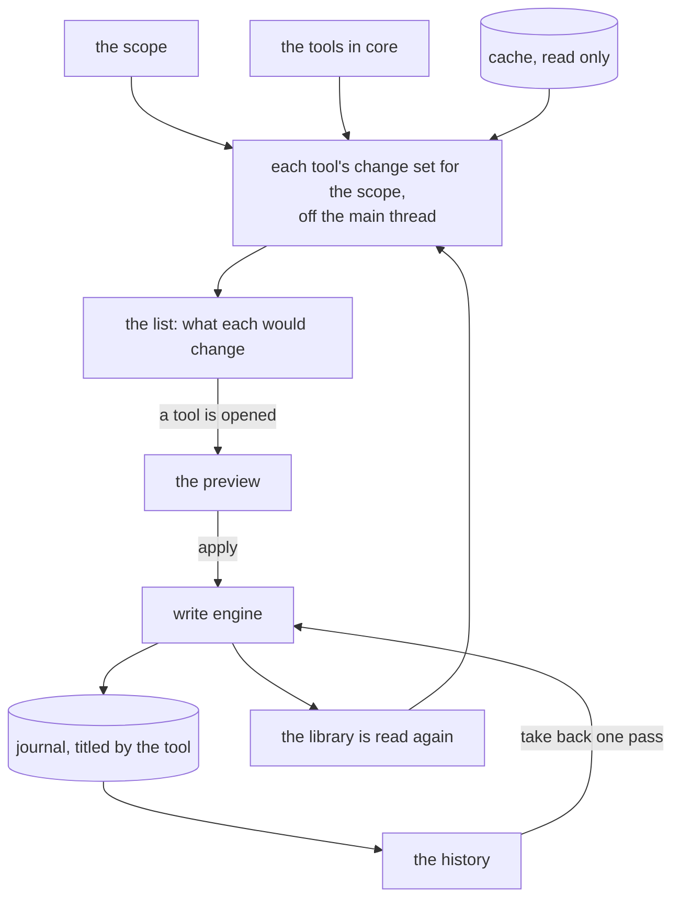
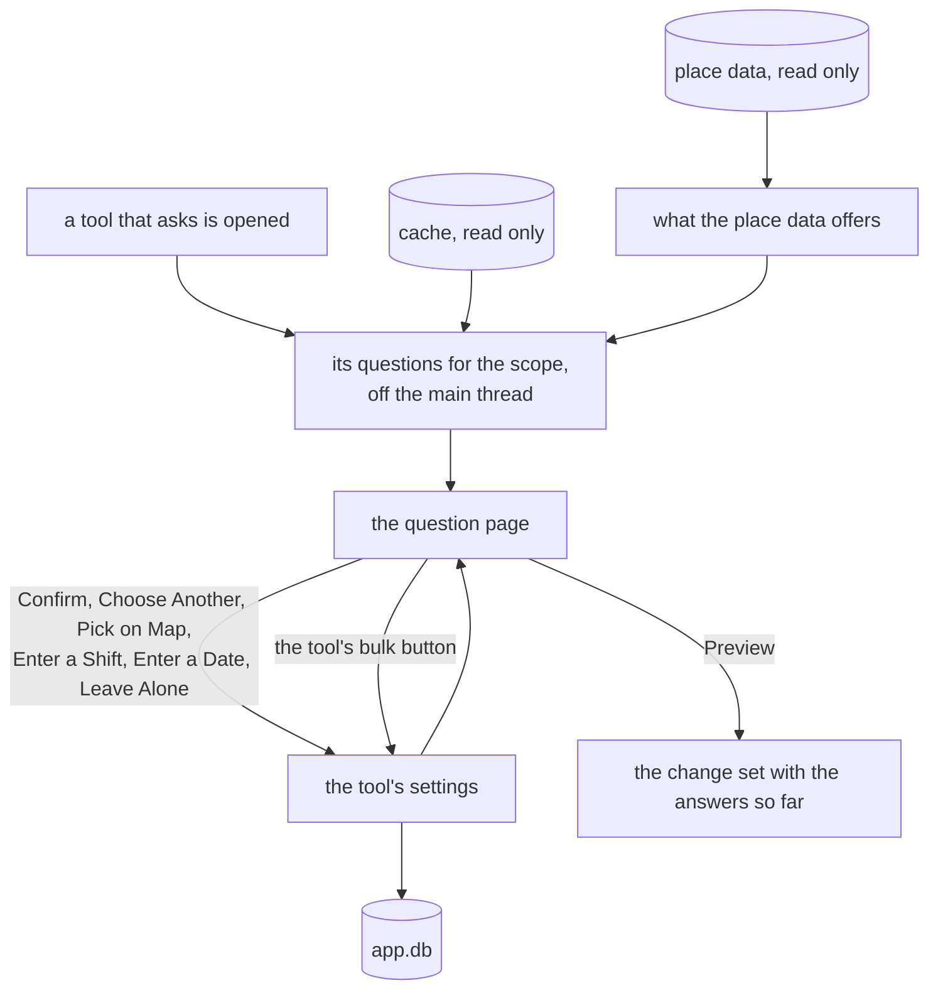
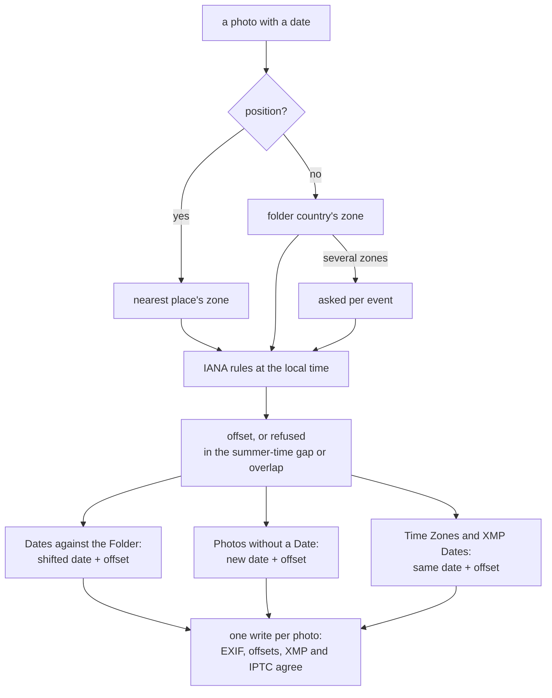

# Tools

A tool fixes one kind of thing across many photos: missing positions, dates that disagree with
their folder, tags in the wrong shape. The Tools tab is where they live: what they work on, what
each would change right now, and every pass that was ever written, any of which can be taken back.

## What a tool is

A tool is a type in `core` with a key, a title, one line on what it fixes, and one question to
answer: given the cache, the place data, a scope and its settings, what should each photo say? The
answer is a list of wanted changes, and that is all a tool ever produces. Turning it into a
[change set](preview.md), counting it, showing it, applying it, writing it down and taking it back
are shared, so a tool never writes and never draws anything itself. What it may do is ask, in
one shape `core` defines: see [Questions and answers](#questions-and-answers).

The window knows the tools only as a list. It shows each one, counts it and opens it by its key,
and names none of them, so a new tool is one type in `core` and one line in the list.

A tool's settings are a plain value that is written as a line of text and read back from it. A
tool without settings has none to write. That is what lets a suggestion open a tool later with its
scope and its settings filled in: a key, a scope and a line of text, not a form.

A development build lists one more tool, a rating over the whole scope, which exists only so the
way from a tool to a photo can be driven and tested.

## The scope

What the tools work on is one choice at the top of the page: the whole library, a country or an
event from the place tree, or what the gallery handed over with Use as Scope. The dialog lists the
same places the gallery browses, with a search over their names. A place is kept as a filter
rather than a list of paths, so it still means the right photos after a scan
([gallery.md](gallery.md#selection-and-scope)).

## What each tool would change

Every tool in the list says how many photos of the scope it would change. The number is not an
estimate: it is the tool's real change set for the scope, built from the cache off the main thread
through a read-only connection, so the number on the row is the number the preview shows when the
tool is opened.

It is counted again whenever the scope changes and after every scan - and every write is followed
by one - so a count never describes a library that is gone. Only the newest count is shown; one
that arrives late is dropped.

Opening a tool builds the same change set again and pushes the [preview](preview.md) on top of
the list. A tool that asks shows its questions first, and its row says what waits for an answer
("8 tags wait for an answer") where a count would say nothing is to be done.

## Questions and answers

Some things a tool cannot decide from the cache: which place a tag like `places/inGreece/Atens`
means, or whether a camera's clock was off, is the person's answer, not a guess. So a tool may hand
over **questions**, each about a group of photos: a key, a title, what kind of answer it wants, how
many photos wait on it, what is offered for it best first, and the answer so far, and sometimes a
note or the evidence it is decided on. Every offer carries the answer it would give and the words
for it, so **Confirm** puts in whatever the best offer is: a place, a shift, a date. The window
draws the questions on one page without knowing which tool asked or what the groups are; the words
on it - what a question is called, the heading, the bulk button - are the tool's.

The kind of a question decides what its row offers beside Confirm, Leave Alone and Ask Again:

| Kind | Answered with | The row's menu adds |
|------|---------------|---------------------|
| a place | a place or a pin | Choose Another, Pick on Map |
| a camera's clock | a shift per camera | the other offers, Enter a Shift |
| a date | a date, or between the neighbours | the other offers, Enter a Date |
| a time zone | one of the country's zones | the other offers |

**Enter a Shift** shows the event's cameras, each with its evidence and an entry, and a camera
left empty is right: `-640d`, `+1y 2d 03:00`. **Enter a Date** takes the one date format. What is
typed is checked before it is kept, and the dialog says what is wrong with it.

A place question is answered with a place, a **pin** or **Leave Alone**. A pin is a point the person
chose on a map, **Pick on Map** in each row's menu: OpenStreetMap tiles, fetched only while the
dialog is open, a click drops the pin and names the town it is in underneath, and **Use This
Point** answers with it. The pin keeps the point and that town, whose name gives the words. Two
pins are the same place only on the same point, and a pin is never the same as a place, even
beside it. A place's position may be 5 000 m off, a pin's 1 000 m: put roughly where it was, not
to the metre.

The answer carries the place itself -
its GeoNames id, name, region, country, code and coordinates - so it does not depend on the place
data it was chosen from, and placing its photos afterwards needs the cache alone. The answers are
the tool's settings: one JSON object, sorted by question, so the same answers are always the same
text, and a suggestion can hand them over like any other settings.

An offer may be **sure**. The page's bulk button - worded by the tool, Confirm Exact Matches or
Confirm Where the Rest Is - answers, in one click, every waiting question whose best offer is
sure, and nothing else. The date tools have none: no shift is sure. What counts as sure is the tool's: see each tool below. Everything else is
one click per question, and the preview afterwards still lists every photo. An answer changes the page at once, without
asking the library again; the row on the list is counted again behind it.

## Remembered settings

The last settings a tool was run or answered with are kept in `app.db`, next to the journal, so
they outlive a cache rebuild. Opening a tool without settings uses them, the list counts with
them, and a question answered once is not asked again - not for another scope, not after a new
import. Taking a pass back leaves the answers as they are; running the tool again puts the change
back on.

## GPS from the places tag

The first tool that asks. It gives photos without a position whose places tag names a city the
coordinates of that city, one question per distinct tag rather than one per photo.

- **Who is asked about.** The photos of the scope without GPS, grouped by their deepest places
  tag: `places/inChina/Beijing`, not the `places/inChina` beside it. A photo with a position is
  never in the change set, however it got that position.
- **What the page offers.** The place data's candidates for the tag's last level, with its
  country level as the hint. Sure is an exact name the place data gives 0.9 or more, so the bulk
  button is **Confirm Exact Matches**. A typo, a region or a made-up place still gets its candidates, and
  the search finds the right one or the tag is left alone; no rule for any spelling is written in
  code.
- **A country alone** (`places/inChina`) is listed apart, starts as Leave Alone and is never
  confirmed in bulk: a country centre is nowhere anyone took a photo. It can still be answered by
  hand, for the country that really is one town.
- **What a photo gets.** The city's coordinates, marked in the file as derived (see
  [writing.md](writing.md#the-canonical-field-set)), and the city, region, country and country code in
  words - but the words only when the photo has none, because writing a place takes away every
  part it does not set. A photo with its own words gets the position alone.
- **Two places on one photo** are refused, with both named, unless both tags were answered with
  the same place. A photo whose other tag still waits is held back until it is answered, so it
  cannot end up placed by the first tag before the second could refuse it.
- **Nothing** reaches a photo whose tag is unanswered or left alone.
- **A tag no place data knows** - a village, a made-up place - is answered with a pin.

## GPS from the event

For the photos the places tag cannot place: no GPS and no places tag that names a city - many
carry the country alone. One question per event folder, sub-folders included, answered with a
place, a pin or Leave Alone for an event that was nowhere in particular.

- **Who is asked about.** The photos of the scope without GPS, in an event folder, without a
  city-level places tag. A photo with a city tag belongs to the places tag, whatever that was
  answered, so a trip over two tagged cities never gives one city's photos the other. A loose
  file is not asked about.
- **Where the rest of the event is**, first. The event's photos that have a position - from the
  camera, or given from the places tag - each put in the town it stands in, from the place data.
  One offer per town, "where 3 of its photos are". A small part of a town, a neighbourhood, counts
  as the town unless the position stands on it, so a walk across a city is that city and not a
  dozen neighbourhoods; a district the size of a town is one. The offer's position is the town's,
  not the photos' average.
- **What the folders name**, after that: the city level of the folder if it has one, then the
  event's name, through the place data with the folder's country as the hint.
- **Inside the folder's country.** Every offer is kept to the country the folder names, not just
  weighed towards it. A folder whose country the place data does not know (a part of a country,
  say) is not narrowed, and the row says so.
- **Sure** is only where the rest is, and only when every located photo of the event stands in the
  same town and there are at least three of them. A split event gets an offer per town, none sure.
  A name is never sure, however exact: an event called `Wedding` is not in the Berlin district of
  that name. The bulk button is **Confirm Where the Rest Is**.
- **Nothing from the country alone**: a country centre is not a place anyone took a photo.
- **What a photo gets** is what the places tag gives, with this tool's mark in the file: the
  position, `photoManager: event` and how far off it may be, and the words only where the photo
  has none. A pin is written at its point.

## The offset of a date

A date without an offset is a time on a clock nobody knows. Every date tool writes the offset
along with the date, by one rule, so a photo is written once whichever of them reaches it first.

Where a photo was is its position's nearest place, else the country its folder names
([places.md](places.md#time-zones)). The offset is that zone's at the photo's local time, from the
IANA rules, so a winter photo in Hamburg gets `+01:00` and a summer one `+02:00`, and Beijing is
`+08:00` all year. A position wins over the folder: a photo in a German folder with a position in
Copenhagen is in Copenhagen's zone. The hour summer time skips does not exist and the hour it
repeats happens twice, so a local time in either is refused with that reason and left for the
photo page, never guessed. So is a photo with no position and no country the place data knows, and
every photo when there is no place data at all.

A photo that has an offset reads as settled to Time Zones and XMP Dates, so a photo the other two
reached is not written again; the list puts them in the order that writes each photo once.

## Dates against the folder

For events whose photos disagree with the date the folder names. One question per event, and the
evidence per camera: how many photos, the first and the last date, and how many days from the
folder. A day either side of a folder's day agrees, as on the [dashboard](dashboard.md); a month or
a year folder agrees with any day inside it.

- **A camera is off** when not one of its photos agrees. A camera with some photos on the folder's
  date and some around it was on a trip longer than the folder says, not wrong, and is offered no
  shift. Photos without a camera name are one "no camera" group.
- **Shift to agree with the others**, where another camera agrees with the folder: the difference
  between the medians of their photos, to the minute.
- **Shift onto the folder day**, where the folder names a whole day: whole days, so the first photo
  lands on it and the time of day stays.
- **The photos are right** is Leave Alone: it writes nothing and is remembered, and fixing the
  folder name is another tool's. It comes first when no camera agrees with the folder.
- **Enter a Shift** for anything else. A shift of more than a year says so on the row.

A shift is per event and camera, never across events: a camera's clock drifts, and the same camera
a year later may be right. It remembers the camera's first date when it was given, so once written
it is never written again, and if the event still disagrees afterwards it is asked about afresh.
The shifted date is written with the offset of where the photo was, or the one it states.

## Photos without a date

One question per event that holds photos without any date.

- **Between its neighbours**: the dated photos of the same folder and the same camera before and
  after it by file name. The photo gets the earlier one's time plus a second per step, so the
  order stays. Offered only between two dated neighbours less than a day apart; a photo at the end
  of its folder, or between two far apart, is refused and left.
- **12:00:00 from the folder**, where the folder names a whole day. A month or a year is no date.
- **Enter a Date** for the rest. A date given to an event goes to its first photo by file name and
  a second more to each one after.

What none of these reach stays for the photo page.

## Time zones and XMP dates

Every photo of the scope with a date and no offset gets the offset of where it was taken, and with
it XMP and IPTC dates that agree with EXIF; the EXIF-shaped XMP dates old writers left, often in
UTC as some other computer saw it, are taken away ([writing.md](writing.md#the-canonical-field-set)).
A photo that states an offset keeps it, so a second run finds nothing to do.

It asks nothing, except where a photo without a position is in a country of several zones: then
one question per event, offered that country's zones. With nothing to ask, its page says so and
Preview still opens.

Over a whole library this is the largest pass there is: nearly every photo, each uploaded once
more, and the preview says how much. Measured over a folder of real photos a write takes around
40 ms, so thousands of photos take minutes; the scope can make it one country or one event at a
time.

## The history

Every pass is in the [journal](writing.md#the-journal), named by what ran it: the tool's title, or
the photo that was edited by hand. The history lists them newest first, fifty at a time, each with
when it ran, how many photos it changed, and whether it was taken back. A pass opens to its photos
and what each one got, tag by tag, or why it was left alone. Passes from before passes had names
read as "Earlier change".

## Taking back any pass

Any pass that changed something and was not taken back yet can be taken back - not only the last.
A pass that took something back cannot itself be taken back; running the tool again is how a
change is put back on.

Taking back an older pass is the engine's own undo, and the engine refuses any photo that no longer
says what the pass wrote. So if a later pass changed the same photo again, the later change stays
and that photo is reported as left alone; nothing newer is ever overwritten by something older.
The confirmation says this before anything runs: how many of the pass's photos a later pass
changed again and will therefore be left as they are. A later change that was itself taken back
for that photo does not count, because the photo says again what the older pass wrote.

| A pass | Can be taken back |
|--------|-------------------|
| a write that changed photos, not taken back | yes |
| a write already taken back | no, once is all |
| a write that changed nothing | no, there is nothing to put back |
| a take-back | no, run the tool again instead |

The toast's Undo and the Undo on a photo's own page still mean the last applied change there.
