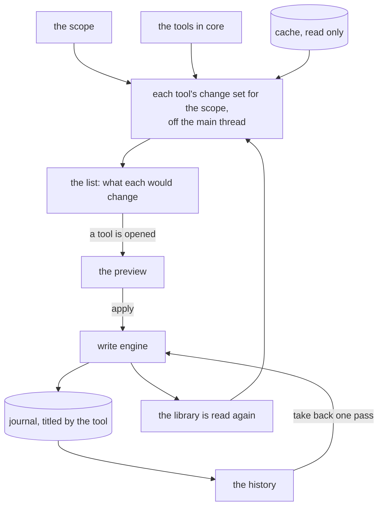

# Tools

A tool fixes one kind of thing across many photos: missing positions, dates that disagree with
their folder, tags in the wrong shape. The Tools tab is where they live: what they work on, what
each would change right now, and every pass that was ever written, any of which can be taken back.

## What a tool is

A tool is a type in `core` with a key, a title, one line on what it fixes, and one question to
answer: given the cache, a scope and its settings, what should each photo say? The answer is a list
of wanted changes, and that is all a tool ever produces. Turning it into a
[change set](preview.md), counting it, showing it, applying it, writing it down and taking it back
are shared, so a tool never writes, never asks and never draws anything itself.

The window knows the tools only as a list. It shows each one, counts it and opens it by its key,
and names none of them, so a new tool is one type in `core` and one line in the list.

A tool's settings are a plain value that is written as a line of text and read back from it. A
tool without settings has none to write. That is what lets a suggestion open a tool later with its
scope and its settings filled in: a key, a scope and a line of text, not a form.

A development build lists one more tool, a rating over the whole scope, which exists only so the
way from a tool to a photo can be driven and tested. A release build has no tool yet and says so.

## The scope

What the tools work on is one choice at the top of the page: the whole library, a country or an
event from the place tree, or what the gallery handed over with Use as Scope. The dialog lists the
same places the gallery browses, with a search over their names. A place is kept as a filter
rather than a list of paths, so it still means the right photos after a scan
([gallery.md](gallery.md#selection-and-scope)).

## What each tool would change

Every tool in the list says how many photos of the scope it would change. The number is not an
estimate: it is the tool's real change set for the scope, built from the cache off the main thread
through a read-only connection, so the number on the row is the number the preview shows when the
tool is opened.

It is counted again whenever the scope changes and after every scan - and every write is followed
by one - so a count never describes a library that is gone. Only the newest count is shown; one
that arrives late is dropped.

Opening a tool builds the same change set again and pushes the [preview](preview.md) on top of
the list. A tool that needs settings will show them on a page of its own first.

## The history

Every pass is in the [journal](writing.md#the-journal), named by what ran it: the tool's title, or
the photo that was edited by hand. The history lists them newest first, fifty at a time, each with
when it ran, how many photos it changed, and whether it was taken back. A pass opens to its photos
and what each one got, tag by tag, or why it was left alone. Passes from before passes had names
read as "Earlier change".

## Taking back any pass

Any pass that changed something and was not taken back yet can be taken back - not only the last.
A pass that took something back cannot itself be taken back; running the tool again is how a
change is put back on.

Taking back an older pass is the engine's own undo, and the engine refuses any photo that no longer
says what the pass wrote. So if a later pass changed the same photo again, the later change stays
and that photo is reported as left alone; nothing newer is ever overwritten by something older.
The confirmation says this before anything runs: how many of the pass's photos a later pass
changed again and will therefore be left as they are. A later change that was itself taken back
for that photo does not count, because the photo says again what the older pass wrote.

| A pass | Can be taken back |
|--------|-------------------|
| a write that changed photos, not taken back | yes |
| a write already taken back | no, once is all |
| a write that changed nothing | no, there is nothing to put back |
| a take-back | no, run the tool again instead |

The toast's Undo and the Undo on a photo's own page still mean the last applied change there.
