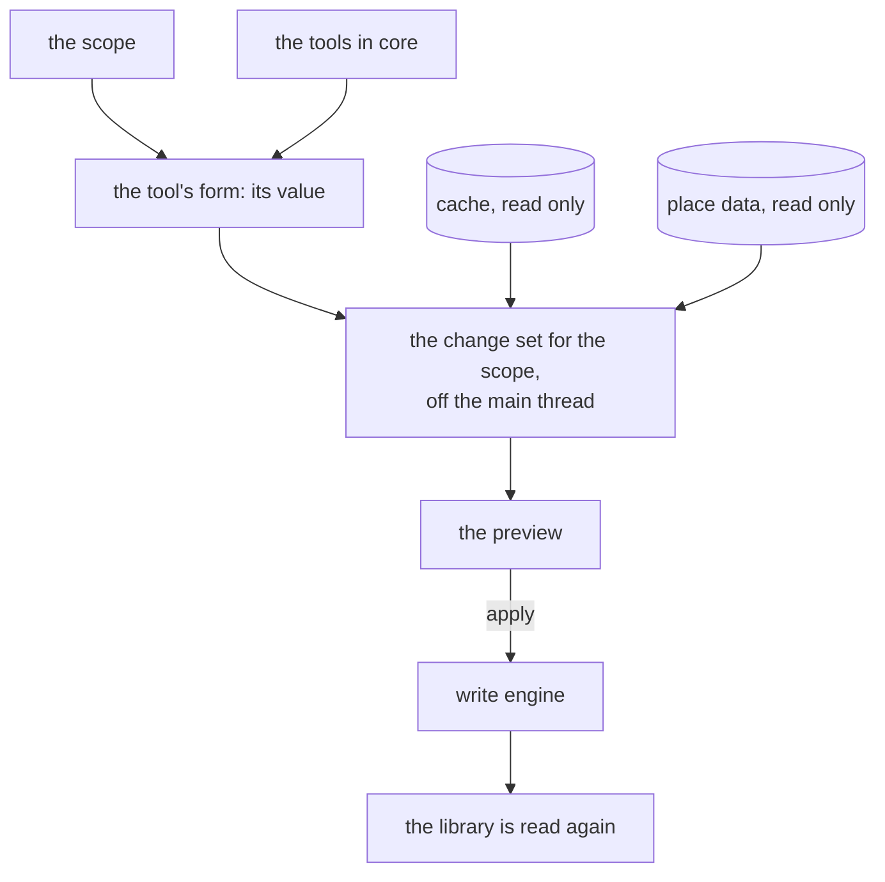
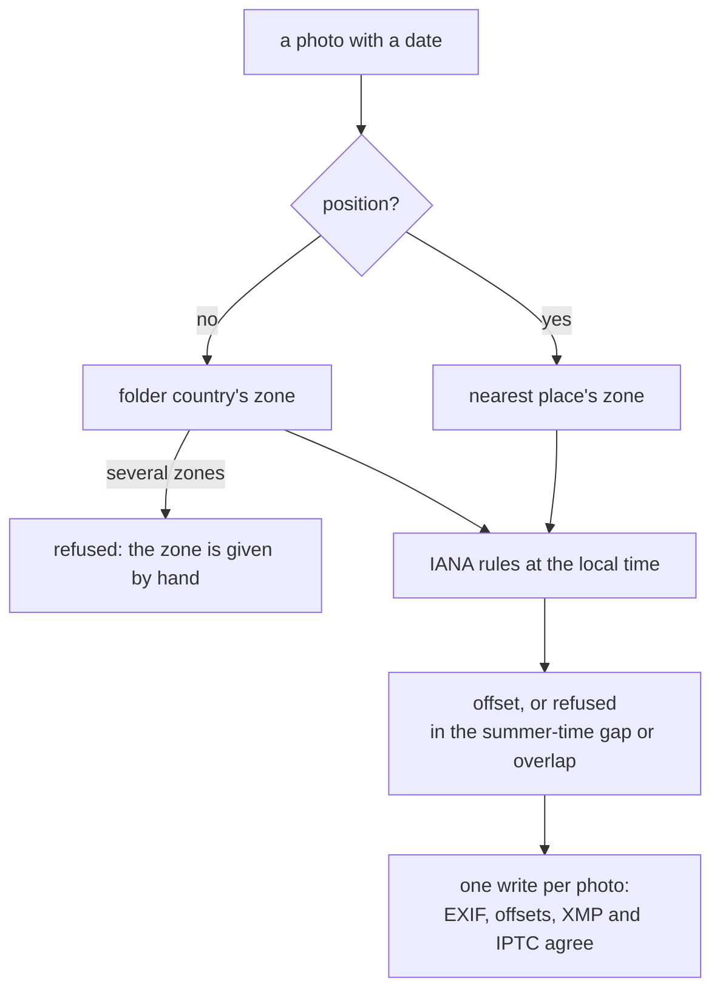
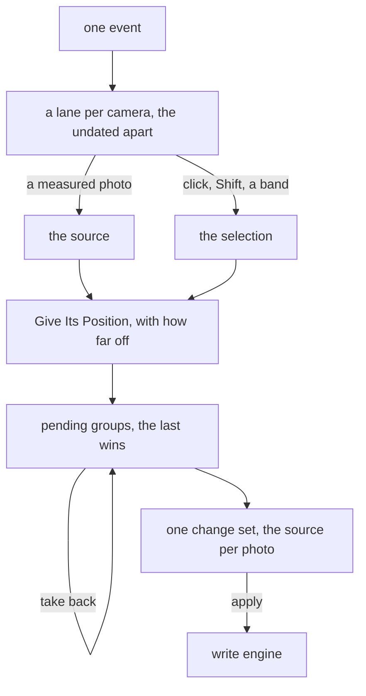

# Tools

A tool is an edit the person drives: a place, a date, a tag or a folder, given once and written to
every photo of the scope, after a preview. What the app is sure about on its own is not here but
on the Suggestions tab ([suggestions.md](suggestions.md)); a tool never guesses and never asks.

## What a tool is

An edit in `core` has a key, a title, one line on what it does, and one question to answer: given
the cache, the place data, a scope and a value, what should each photo say? The answer is a
[change set](preview.md), and turning it into rows, counting it, showing it and applying it are
shared, so an edit never writes and never draws anything itself.

| Tool | The value | What a photo gets |
|------|-----------|-------------------|
| Set Place | a place from the search, or a pin on the map | the position and the place in words |
| Shift Dates | a shift per camera of the scope | its date moved by its camera's shift |
| Set Date | one date | that date, a second more for each photo after the first |
| Set Time Zone | a zone, or where each photo was taken | the offset, with XMP and IPTC dates that agree |
| Add Tag | a tag | the tag, with what it had |
| Remove Tag | a tag | its tags without it and everything below it |
| Rename Tag | a tag and its new name | the tag and everything below it under the new name |
| Tidy Tags | what becomes of the generated tags | every tag field the same |
| Move Event | the folder of the scope's one event | its event folder moved there |
| Position from a Neighbour | a measured photo of one event, the photos taken where it was, how far off | the measured photo's position, marked as borrowed |

Each asks its value in a form of its own, checked before the preview, and the form says what is
wrong with it. Nothing is remembered: the next time the form is empty again.

```mermaid
flowchart TD
    scope[the scope] --> form
    list[the tools in core] --> form[the tool's form: its value]
    form --> build[the change set for the scope,<br/>off the main thread]
    cache[(cache, read only)] --> build
    geo[(place data, read only)] --> build
    build --> preview[the preview]
    preview -- apply --> engine[write engine]
    engine --> scan[the library is read again]
```

## The scope

What the tools work on is one choice at the top of the page: the whole library, a country or an
event from the place tree, or what the gallery handed over with Use as Scope. The row says how
many photos it names. The dialog lists the same places the gallery browses, with a search over
their names. A place is kept as a filter rather than a list of paths, so it still means the right
photos after a scan ([gallery.md](gallery.md#selection-and-scope)).

The dashboard and the gallery are how the photos an edit is for are found: the photos without a
place, of one event, with a tag, then Use as Scope.

## Set Place

The photos of the scope without a position of their own get the place: those without one, and
those whose position was worked out rather than taken, such as a city centre given from a tag. A
photo whose camera knew where it was is refused, and says so.

- **A place** comes from the place data's search, a **pin** from a click on a map: OpenStreetMap
  tiles, fetched only while the map is open, the town the click is in named underneath.
- **What a photo gets**: the position, marked in the file as set by hand and how far off it may
  be - a place's centre 5 000 m, a pin 1 000 m ([writing.md](writing.md#the-canonical-field-set))
  - and the city, region, country and country code in words. A pin is written at its point.

## The offset of a date

A date without an offset is a time on a clock nobody knows. Every date tool writes the offset
along with the date, by one rule, so a photo is written once whichever of them reaches it first.

Where a photo was is its position's nearest place, else the country its folder names
([places.md](places.md#time-zones)). The offset is that zone's at the photo's local time, from the
IANA rules, so a winter photo in Hamburg gets `+01:00` and a summer one `+02:00`, and Beijing is
`+08:00` all year. A position wins over the folder. The hour summer time skips does not exist and
the hour it repeats happens twice, so a local time in either is refused, never guessed. So is a
photo with no position and no country the place data knows, and one in a country of several zones
without a position: its zone is given by hand.

```mermaid
flowchart TD
    photo[a photo with a date] --> pos{position?}
    pos -- yes --> nearest[nearest place's zone]
    pos -- no --> country[folder country's zone]
    country -- several zones --> given[refused: the zone is given by hand]
    nearest --> rules[IANA rules at the local time]
    country --> rules
    rules --> offset[offset, or refused<br/>in the summer-time gap or overlap]
    offset --> write[one write per photo:<br/>EXIF, offsets, XMP and IPTC agree]
```

## Shift Dates

For a camera whose clock was off. The form lists the cameras of the scope's dated photos, each with
how many photos and its first and last date; a shift is typed per camera, such as `-640d` or
`+1y 2d 03:00`, and a camera left empty is right. Photos without a camera name are one "no camera"
group. Each photo of a shifted camera is moved by its shift and keeps the offset it states, else
gets the one of where it was, where that is known.

## Set Date

One date, in the one format, for the photos of the scope: the first by file name gets it, each one
after a second more, so their order stays. For the photos without a date, the gallery's "no date"
of one event is the scope. The offset is the one the photo states, else where it was.

## Set Time Zone

Where each photo was taken, by default: every dated photo of the scope without an offset gets the
one of where it was, and a photo that states one keeps it, so a second run finds nothing. A zone
typed - `Europe/Berlin` - is written on every dated photo of the scope instead, its own offset or
not. Either way the XMP and IPTC dates are written to agree with EXIF, and the EXIF-shaped XMP
dates old writers left, often in UTC, are taken away
([writing.md](writing.md#the-canonical-field-set)).

Over a whole library this is the largest pass there is: nearly every photo, each uploaded once
more, and the preview says how much. Measured over a folder of real photos a write takes around
40 ms, so thousands of photos take minutes; the scope can make it one country or one event at a
time.

## The tags

One vocabulary instead of four: every tag write puts every path with every level into all five
tag fields ([cache.md](cache.md#tag-fields)), and takes away the label and the catalog sets older
writers left.

- **Add Tag** adds one tag, its levels separated by `/`, to every photo of the scope; what a photo
  carries stays. A photo that carries it already in every field has nothing to do.
- **Remove Tag** takes a tag and everything below it off the photos of the scope that carry it.
- **Rename Tag** moves a tag and everything below it to a new name. Renaming a leaf, moving a
  branch to another parent and merging into a tag that is already there are all this one edit.
  Only the photos that carry it are written. A rename into itself, or with an empty level or a
  separator inside one, is refused before the preview.
- **Tidy Tags** writes every photo of the scope the same in every field, and chooses what becomes
  of the generated tags: the year, place and event tags that repeat what the date, the place words
  and the folder say. **Derived from the data** makes `timeline/<year>`,
  `places/in<Country>/<City>` and `events/<year> <name>` from them, each replacing the whole
  branch of its root, so they can never disagree with it; they can also be **dropped**, or **left
  as they are**. A tidy photo that would say the same is left out.

The tag forms list the tree with a search, so a tag is chosen rather than remembered.

**Immich** reads the tags from the files on its next library scan and replaces a photo's tags with
what the file says, so a renamed tag moves there too. A tag no photo carries any more stays in
Immich's tag list until its tag cleanup job is started by hand.

## Move Event

The [folder layout](cache.md#folder-names) is chosen in Preferences - by default
`Country/[City/]YYYY-MM-DD Event`. Move Event takes the scope's one event - a scope in several
events or none is refused - and moves it, with its sub-folders, into the folder given: only the
folder, never a byte of a photo ([writing.md](writing.md#moving-a-folder)).

- **The form** has one entry per level of the layout the user names - the year and the month come
  from the date - and the event's name, with the path now and the path after, said again with
  every letter. It starts from where the photos say the event belongs, as the
  [Folders suggestion](suggestions.md#folders) works it out, else from where it is.
- **Refused, with why.** A target that is not in the layout, or is there already, in the cache or
  on disk; a changed date in the event's folder name; a folder with a file the scan does not know,
  or without one it does. And **the people gate**: an event is not moved while Immich names people
  in its photos that the files do not say. A move makes Immich forget the photos and learn them
  again, faces included, so the people go into the files first
  ([suggestions.md](suggestions.md#people)).
- **One pass**: a move is never written together with a change to a photo.

## Position from a Neighbour

An event whose photos stand on a town centre a tag or the event gave them often holds a photo or
two that measured where they were: a friend's phone, a camera that had a fix for a while. Its
position is closer to the truth than any centre, so the photos taken at the same spot borrow it.
Which photos those are is for the eye to say, not for a rule: clocks of two cameras disagree, and
a phone without a fix indoors took its photos in the same room as the one with a fix.

- **The event as a timeline.** The tool takes the scope's one event, or the one the dashboard or
  the gallery hands over, its sub-folders included. Each camera is a lane - make and model, the
  photos without one an unknown camera - in the order of their first photo, and the photos sit
  along one time axis by their date, stacked where they crowd. A measured position is framed
  green with a pin, a derived one is dashed with its mark, a photo without one is plain. The
  photos without a date wait in a strip of their own, in name order. The axis zooms from a
  minute to days per hundred pixels.
- **Clocks for the eye.** A lane can be moved along the axis by minutes, so the photos of one
  moment line up across cameras. That is all it does: the dates are Shift Dates', and the move is
  forgotten when the page closes.
- **Pick and give.** A click on a measured photo makes it the source; its position is shown on a
  map only when asked. The photos taken where it was are selected by click, Shift for a run, or a
  band dragged across the lanes, and **Give Its Position** makes them a pending group with how far
  off the position may be: the same spot (50 m), the same street (200 m) or the same area (1 km).
  A group is drawn on the timeline in a colour of its own, and another measured photo gives the
  next one. A photo in two groups belongs to the last. A group can be taken back until the
  preview is applied.
- **Never over a measurement.** A photo that measured its own position cannot be selected, and the
  change set refuses it on its own, as it refuses a source that did not measure where it was and
  a photo outside the event. A derived position, a neighbour's included, may be replaced.
- **What a photo gets**: the source's position, marked in the file as from a neighbour with the
  reach as how far off it may be ([writing.md](writing.md#the-canonical-field-set)), and the city,
  region, country and code of that position from the place data. The source's name is not
  written, since a file name changes; the preview says it per photo - `from DSCF0102.JPG, 200 m`.
  A photo that already borrowed the same position has nothing to do.

```mermaid
flowchart TD
    event[one event] --> timeline[a lane per camera, the undated apart]
    timeline -- a measured photo --> source[the source]
    timeline -- click, Shift, a band --> selected[the selection]
    source --> give[Give Its Position, with how far off]
    selected --> give
    give --> groups[pending groups, the last wins]
    groups -- take back --> groups
    groups --> preview[one change set, the source per photo]
    preview -- apply --> engine[write engine]
```

The dashboard lists the events where this helps: a photo measured its position and others did
not ([dashboard.md](dashboard.md#what-each-field-means)).
