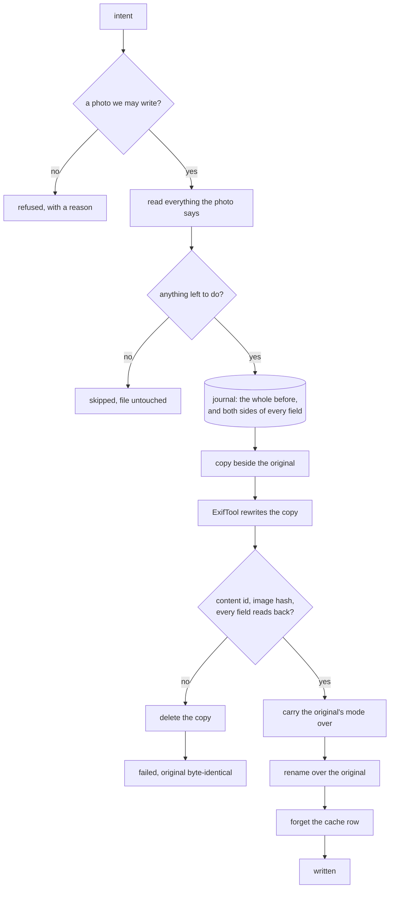

# Writing

The photos are the truth, so this is the only part of photoManager that ever changes one. It takes
an intent - these tags, this position, this date, this rating, these faces - and turns it into a
file on disk that carries exactly that and nothing else changed. Every change is written down
before it happens, proved afterwards, and can be taken back.

Nothing writes on its own. A write happens because someone confirmed a preview: a tool produces a
change set, the window shows it, and only the rows the user kept are handed to the engine. That is
the only way from the window to a photo - [preview.md](preview.md).

## One write

ExifTool is never pointed at a photo in the library. The engine copies the file to a temporary name
beside it, lets ExifTool rewrite the copy, checks the copy is what was asked for, gives it the
original's mode, and only then renames it over the original. The rename is on one filesystem, so it
is atomic: until that moment the original is untouched, and at no point does a half-written photo
exist under the photo's name.

Every photo ends as one of four things, and only the first one touched the file:

| Outcome | Means |
|---------|-------|
| written | the file now says what was asked, and it was proved |
| skipped | it already said it, so nothing was written |
| refused | we would not try: not in the library, not a JPEG, image data moved under us, an intent that cannot be written |
| failed | we tried, it did not work out, and the photo is exactly as it was |

A refusal or a failure on one photo never stops the rest of a pass. A failure says ExifTool's own
reason, its error before any warning printed ahead of it. A file ExifTool will only write when told
to ignore a minor error - camera MakerNotes whose offsets it doubts - fails with that reason and is
never forced.

The same intent can be asked about without doing any of it: a **dry run** goes down this path as
far as the journal and then stops, and answers with every tag the write would set and the value
that tag has now. It is what the preview shows when one photo is asked about in detail, so the
exact detail a person checks is never a guess about what the write would do.

## What is proved

Three questions, and all of them have to answer yes before the rename:

- our **content id** is the same - xxh3-128 over the image data with the metadata segments left
  out, the same id the [cache](cache.md) recognises a photo by,
- ExifTool's **`ImageDataHash`** is the same - a second opinion, from a different implementation,
  on the same claim,
- **every field that was set reads back** as what was asked for.

The first two are what "never lose a byte of the original image data" means in code. They cost a
re-read of the whole file, every time, and that is the price of the guarantee: measured over a
folder of real photos, a write with verification takes about 110 ms per photo, and a pass where
everything is already right about 53 ms.

Verification compares what was asked against what the file says, not text against text. A tag list
is a set, so the same tags in another order are the same tags. A number that went through a
rational comes back rounded, so numbers compare within a tolerance. A list of one reads back as a
bare value. Inside a structure, order matters.

## Two names per field

ExifTool is written with one name and reads the same value back under another: `EXIF:GPSLatitude`
goes in, `GPS:GPSLatitude` comes out; `EXIF:DateTimeOriginal` comes back as
`ExifIFD:DateTimeOriginal`. So an intent becomes a flat list of assignments, and each one carries
both names. Everything downstream works on that one list: the arguments ExifTool gets, the decision
that there is nothing left to do, the journal entry, and the proof.

Latitude and longitude are a size and a hemisphere in the file, never a signed number, so that is
how they are written and how they are proved.

Every tag is emptied before it is filled. ExifTool *adds* to a list it is given a value for, so
setting one without clearing it first would append instead of replace.

## The canonical field set

One combined write per photo: Nextcloud re-uploads the whole file for every edit, so a photo is
visited as few times as possible, and it is never left half written.

| Intent | Goes into |
|--------|-----------|
| tags | `XMP-digiKam:TagsList` and `XMP-microsoft:LastKeywordXMP` (`/`), `XMP-lr:HierarchicalSubject` (`\|`), flat `XMP-dc:Subject` and `IPTC:Keywords` |
| position | `EXIF:GPSLatitude`/`Ref`, `GPSLongitude`/`Ref`, optional `GPSAltitude`/`Ref`, `GPSMapDatum`; for a derived position also `GPSProcessingMethod` (`photoManager: ` and from what) and `GPSHPositioningError` (how many metres off it may be), which a measured position takes away |
| place in words | `XMP-photoshop:City`/`State`/`Country`, `XMP-iptcCore:CountryCode`/`Location`, and the five IPTC spellings |
| date | `EXIF:DateTimeOriginal` and `CreateDate` with `OffsetTimeOriginal`/`Digitized`/`OffsetTime`, `XMP-xmp:CreateDate`, `XMP-photoshop:DateCreated`, `IPTC:DateCreated`/`TimeCreated`; takes away `XMP-exif:DateTimeOriginal` and `DateTimeDigitized` |
| rating | `XMP-xmp:Rating`, and nowhere else |
| faces | `XMP-mwg-rs:RegionInfo` and `XMP-iptcExt:PersonInImage` |

All five tag fields say the same thing, because different readers each read a different one, and
they carry every level of every path: `places/inChina/Beijing` also means `places` and
`places/inChina`. A level may not contain the separators, and a path with an empty level is
refused.

A position worked out rather than measured - a city centre derived from a tag, an event's town, a
point chosen on a map - says so in the file itself, in two standard EXIF fields every GPS viewer
shows and none uses to place the pin. So the file, not the database, is what remembers that a position is a guess; the scan reads the mark
back and the photo's panel shows it, and the preview writes "(derived)" after such a position.

EXIF leads on dates because every reader believes it; the XMP and IPTC dates are made to agree with
it, and the EXIF-shaped XMP dates some old writers left behind, often in UTC worked out on another
computer, are taken away. Without an offset `IPTC:TimeCreated` is left out, because ExifTool would
fill in the computer's own zone. `XMP-xmp:Label` is
never written, only cleared, because in this library it was misused as a keyword.

The modification time is deliberately **not** preserved. Nextcloud and Immich both notice a changed
file only by its mtime, so a write nothing notices would be worse than no write at all. For the
same reason the photo's cache row is forgotten after a write, so the next scan reads the file again
instead of trusting a stale row.

## One ExifTool

One long-lived `exiftool -stay_open True -@ -` process does the whole pass, with one command per
photo carrying all of that photo's fields. A cold start costs around 200 ms and a write through a
process that is already up around 7 ms, which over thousands of photos is the difference between
minutes and an hour.

Each command ends with `-execute<n>`, and ExifTool answers with `{ready<n>}` on standard output;
`-echo4` puts a matching marker on standard error. Both streams are therefore drained to a known
end rather than guessed at. Each stream is read by its own thread so the wait can have a deadline:
silence for a minute is reported rather than waited on for ever. A process that dies is started
again and the command repeated once, which is safe because every command is either a read or a
write of a temporary copy.

## The journal

Everything that is about to happen is committed to `$XDG_DATA_HOME/…/app.db` before ExifTool is
asked to do anything. Nothing is written to a photo that is not already in the journal.

Unlike the cache and the place data this database is **not** disposable, and it is never deleted to
get past a schema it does not know: the old values it holds are the only copy of what a photo used
to say, and an undo has to outlive a cache rebuild.

| Table | Holds |
|-------|-------|
| `batch` | one pass: what kind, what ran it (a title, and a tool's key when a tool did), when it started and finished, and which batch it undoes |
| `entry` | one photo in a pass: its path, its content id, everything it said before the write in full, ExifTool's hash of its image data, and what became of it |
| `swap` | one field of one entry: the tag, the name it reads back under, and its old and new value |

An entry without an outcome and a batch without a finish are how an interrupted pass makes itself
known on the next start.

The journal carries its schema version. One it does not know is refused outright and left as it
is. One it knows how to bring forward is copied first - the whole database as SQLite sees it, the
write-ahead log included, to a file beside it named after the old version - and then migrated in
one transaction that only adds: new columns, nothing rewritten, nothing dropped. The first such
step gave batches their names; a batch from before it has none and reads as "Earlier change".

## Taking it back

An undo puts values back, not files. Keeping a second copy of every photo is not on, and it is not needed: only
metadata is ever changed and the image data is proved not to have moved, so restoring the old field
values restores the photo. Fields that were not there before are removed.

It goes through the same engine, with the same proof, and is journaled itself as a batch that says
which batch it undoes and is named after it: "Take back: " and its title. Any batch can be undone,
not only the last - [tools.md](tools.md#taking-back-any-pass). Two things make it refuse: a batch that was already undone, and a photo that
no longer says what the write left in it - checked field by field against the journal, so an edit
made by something else in the meantime is never quietly overwritten.

## Keeping away from the photos

- No test writes to a real photo. Every test builds a stand-in library of its own, and the fixture
  builder refuses any target inside `~/Nextcloud`.
- The engine refuses any path that is not inside the configured library, resolved through symlinks
  before it is compared.
- A photo whose content id is not the one the change was built against is refused: it has moved
  under us.
- The original is only ever replaced by renaming a file that has already passed verification.
