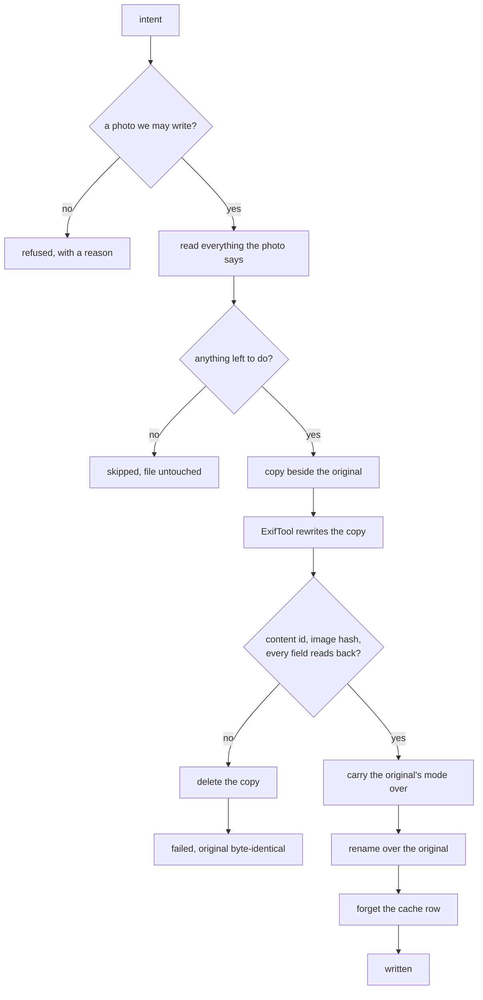
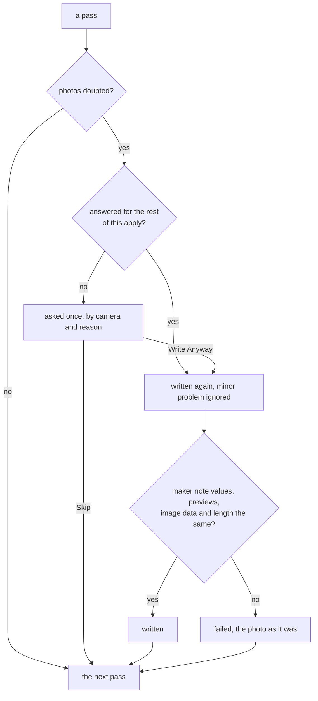
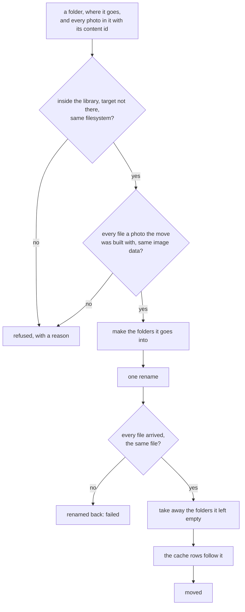

# Writing

The photos are the truth, so this is the only part of photoManager that ever changes one. It takes
an intent - these tags, this position, this date, this rating, these faces - and turns it into a
file on disk that carries exactly that and nothing else changed. Every change is proved before it
replaces the file. There is no undo: the user's own backup is the way back.

Nothing writes on its own. A write happens because someone confirmed a preview: a tool produces a
change set, the window shows it, and only the rows the user kept are handed to the engine. That is
the only way from the window to a photo - [preview.md](preview.md).

## One write

ExifTool is never pointed at a photo in the library. The engine copies the file to a temporary name
beside it, lets ExifTool rewrite the copy, checks the copy is what was asked for, gives it the
original's mode, and only then renames it over the original. The rename is on one filesystem, so it
is atomic: until that moment the original is untouched, and at no point does a half-written photo
exist under the photo's name.

```mermaid
flowchart TD
    intent[intent] --> guards{a photo we may write?}
    guards -- no --> refused[refused, with a reason]
    guards -- yes --> before[read everything the photo says]
    before --> settled{anything left to do?}
    settled -- no --> skipped[skipped, file untouched]
    settled -- yes --> copy[copy beside the original]
    copy --> write[ExifTool rewrites the copy]
    write --> prove{content id, image hash,<br/>every field reads back?}
    prove -- no --> drop[delete the copy]
    drop --> failed[failed, original byte-identical]
    prove -- yes --> mode[carry the original's mode over]
    mode --> rename[rename over the original]
    rename --> forget[forget the cache row]
    forget --> written[written]
```

Every photo ends as one of four things, and only the first one touched the file:

| Outcome | Means |
|---------|-------|
| written | the file now says what was asked, and it was proved |
| skipped | it already said it, so nothing was written |
| refused | we would not try: not in the library, not a JPEG, image data moved under us, an intent that cannot be written |
| failed | we tried, it did not work out, and the photo is exactly as it was |
| doubted | ExifTool would write it only if told to ignore a minor problem with the camera's maker note; the photo is exactly as it was |

A refusal or a failure on one photo never stops the rest of a pass. A failure says ExifTool's own
reason, its error before any warning printed ahead of it.

## Written anyway

Some cameras store their maker note - their own part of the photo's data, settings and a small
preview - in a way ExifTool doubts: a directory cut short, or parts that are not where its table
says. To add anything to the EXIF, the maker note has to move inside the file, and ExifTool will
only move one it doubts when told to ignore that minor problem. The engine never tells it on its
own. Such a photo comes back **doubted**, and only a minor problem with the maker note is; every
other error stays a failure.

When a pass doubted photos, the user is asked once, at the end of the pass and before the next
one: the photos by camera and reason, what the maker note is, and what writing anyway does. On
**Write Anyway** those photos are written again with ExifTool told to ignore the problem, and the
copy has a fourth question to answer before it may take the original's place: does every value of
the maker note read back the same, less the ones that only say where a part sits, are the preview
and the thumbnail the same bytes, and is the maker note as long as it was. ExifTool leaves out a
part of a maker note it cannot read rather than move it, so a maker note that would come out
shorter fails, and the photo stays exactly as it was. A maker note is never repaired and never
dropped. **Skip** leaves them, and their fix is offered again.

While applying several suggestions, the answer can be given for the rest of that apply: the passes
that follow write their doubted photos anyway without asking. It is kept nowhere and ends with
the apply.

```mermaid
flowchart TD
    pass[a pass] --> doubted{photos doubted?}
    doubted -- no --> next[the next pass]
    doubted -- yes --> always{answered for the rest<br/>of this apply?}
    always -- yes --> anyway
    always -- no --> ask[asked once, by camera and reason]
    ask -- Skip --> next
    ask -- Write Anyway --> anyway[written again, minor problem ignored]
    anyway --> proof{maker note values, previews,<br/>image data and length the same?}
    proof -- yes --> written[written]
    proof -- no --> failed[failed, the photo as it was]
    written --> next
    failed --> next
```

The same intent can be asked about without doing any of it: a **dry run** goes down this path as
far as the copy and then stops, and answers with every tag the write would set and the value
that tag has now. It is what the preview shows when one photo is asked about in detail, so the
exact detail a person checks is never a guess about what the write would do.

## What is proved

Three questions, and all of them have to answer yes before the rename:

- our **content id** is the same - xxh3-128 over the image data with the metadata segments left
  out, the same id the [cache](cache.md) recognises a photo by,
- ExifTool's **`ImageDataHash`** is the same - a second opinion, from a different implementation,
  on the same claim,
- **every field that was set reads back** as what was asked for.

The first two are what "never lose a byte of the original image data" means in code. They cost a
re-read of the whole file, every time, and that is the price of the guarantee: measured over a
folder of real photos, a write with verification takes about 110 ms per photo, and a pass where
everything is already right about 53 ms.

Verification compares what was asked against what the file says, not text against text. The same
items of a list in another order are the same list, but an item listed twice is not: a list with a
copy in it is written again without. A number that went through a
rational comes back rounded, so numbers compare within a tolerance. A list of one reads back as a
bare value. Inside a structure, order matters.

## Two names per field

ExifTool is written with one name and reads the same value back under another: `EXIF:GPSLatitude`
goes in, `GPS:GPSLatitude` comes out; `EXIF:DateTimeOriginal` comes back as
`ExifIFD:DateTimeOriginal`. So an intent becomes a flat list of assignments, and each one carries
both names. Everything downstream works on that one list: the arguments ExifTool gets, the decision
that there is nothing left to do, and the proof.

Latitude and longitude are a size and a hemisphere in the file, never a signed number, so that is
how they are written and how they are proved.

Every tag is emptied before it is filled. ExifTool *adds* to a list it is given a value for, so
setting one without clearing it first would append instead of replace.

## The canonical field set

One combined write per photo: Nextcloud re-uploads the whole file for every edit, so a photo is
visited as few times as possible, and it is never left half written.

| Intent | Goes into |
|--------|-----------|
| tags | `XMP-digiKam:TagsList` and `XMP-microsoft:LastKeywordXMP` (`/`), `XMP-lr:HierarchicalSubject` (`\|`), flat `XMP-dc:Subject` and `IPTC:Keywords` |
| position | `EXIF:GPSLatitude`/`Ref`, `GPSLongitude`/`Ref`, optional `GPSAltitude`/`Ref`, `GPSMapDatum`; for a derived position also `GPSProcessingMethod` (`photoManager: ` and from what) and `GPSHPositioningError` (how many metres off it may be), which a measured position takes away |
| place in words | `XMP-photoshop:City`/`State`/`Country`, `XMP-iptcCore:CountryCode`/`Location`, and the five IPTC spellings |
| date | `EXIF:DateTimeOriginal` and `CreateDate` with `OffsetTimeOriginal`/`Digitized`/`OffsetTime`, `XMP-xmp:CreateDate`, `XMP-photoshop:DateCreated`, `IPTC:DateCreated`/`TimeCreated`; takes away `XMP-exif:DateTimeOriginal` and `DateTimeDigitized` |
| rating | `XMP-xmp:Rating`, and nowhere else |
| faces | `XMP-mwg-rs:RegionInfo` (type Face, a name, a box centred and as a fraction of the stored picture, the stored size in pixels as `AppliedToDimensions`) and `XMP-iptcExt:PersonInImage`, both replaced as a whole |
| persons | `XMP-iptcExt:PersonInImage` alone, the photo's whole list: every box's name, every name it had, and the new ones; the region list is not touched |
| event | `XMP-iptcExt:Event`, the IPTC Extension field for the event a photo belongs to, as the default language: the event's name on one line, without its date |
| leftovers | takes away `XMP-xmp:Label` and `XMP-mediapro:CatalogSets`, where older writers left keywords; [every tag write](tools.md#the-tags) takes both away |

All five tag fields say the same thing, because different readers each read a different one, and
they carry every level of every path: `places/inChina/Beijing` also means `places` and
`places/inChina`. A level may not contain the separators, and a path with an empty level is
refused.

A position worked out rather than measured - a city centre derived from a tag, an event's town, a
point chosen on a map - says so in the file itself, in two standard EXIF fields every GPS viewer
shows and none uses to place the pin. So the file, not the database, is what remembers that a position is a guess; the scan reads the mark
back and the photo's panel shows it, and the preview writes "(derived)" after such a position.

EXIF leads on dates because every reader believes it; the XMP and IPTC dates are made to agree with
it, and the EXIF-shaped XMP dates some old writers left behind, often in UTC worked out on another
computer, are taken away. Without an offset `IPTC:TimeCreated` is left out, because ExifTool would
fill in the computer's own zone. `XMP-xmp:Label` is
never written, only cleared, because in this library it was misused as a keyword.

A person without a box - a back of a head, a face too small, someone no face recognition knows -
is a name in `PersonInImage` and nothing else: no box is made up for them. Such a write carries the
whole list, so it is refused when the file, read just before, names anyone the list leaves out; a
person is only ever added. The list is settled in any order, and a box keeps its name and its
place byte for byte.

The event is the name alone - `Summer Party`, not `2019-07-13 Summer Party` - because the date has
fields of its own and a folder date with holes is no date. Once a photo carries it, the field is
the truth and the folder follows it ([Folders](suggestions.md#folders)); the photo keeps its event
when it is copied or exported out of its folder. digiKam and Lightroom show the field; Immich does
not read it.

The modification time is deliberately **not** preserved. Nextcloud and Immich both notice a changed
file only by its mtime, so a write nothing notices would be worse than no write at all. For the
same reason the photo's cache row is forgotten after a write, so the next scan reads the file again
instead of trusting a stale row.

## One ExifTool

One long-lived `exiftool -stay_open True -@ -` process does the whole pass, with one command per
photo carrying all of that photo's fields. A cold start costs around 200 ms and a write through a
process that is already up around 7 ms, which over thousands of photos is the difference between
minutes and an hour.

Each command ends with `-execute<n>`, and ExifTool answers with `{ready<n>}` on standard output;
`-echo4` puts a matching marker on standard error. Both streams are therefore drained to a known
end rather than guessed at. Each stream is read by its own thread so the wait can have a deadline:
silence for a minute is reported rather than waited on for ever. A process that dies is started
again and the command repeated once, which is safe because every command is either a read or a
write of a temporary copy.

## Moving a folder

The engine has one more thing it does besides writing fields: it takes a folder or a photo to
another place in the library. Nothing inside a photo changes, not even its modification time; a
rename keeps them all. It is how an event goes into its place in the folder layout, a photo
lying loose in a folder into an event, or a photo to its new name in the same folder.

An event moves by **one rename**. On one filesystem that is atomic: the event is in its old folder
or in its new one, never half in each, whatever happens in between. Its sub-folders go with it as
they are.

```mermaid
flowchart TD
    move[a folder, where it goes,<br/>and every photo in it with its content id] --> guards{inside the library, target not there,<br/>same filesystem?}
    guards -- no --> refused[refused, with a reason]
    guards -- yes --> prove{every file a photo the move<br/>was built with, same image data?}
    prove -- no --> refused
    prove -- yes --> parents[make the folders it goes into]
    parents --> rename[one rename]
    rename --> check{every file arrived,<br/>the same file?}
    check -- no --> back[renamed back: failed]
    check -- yes --> prune[take away the folders it left empty]
    prune --> rows[the cache rows follow it]
    rows --> moved[moved]
```

- **Nothing is overwritten.** A target that is there already refuses the move. A target on another
  filesystem refuses it too, because the rename would become a copy, and a photo is never copied.
- **Every file is accounted for.** Before the rename every file in the folder must be a photo the
  move was built with, read again to prove its image data is the one the cache knew. A file the
  scan did not know, or one gone since, refuses the move: scan first. After the rename every file
  must be there under the new name as the same file.
- **Only what it left empty goes.** The folder it moved out of is taken away if the move left it
  empty, and its parent after it, but never the library itself and never a folder with anything in
  it. The folders it made for itself go again if the rename fails.

A process stopped in the middle of a move leaves the event in its old folder or in its new one,
because the move is one rename; the next scan sees which. At most a folder made for it, or one it
left empty, stays behind.

## No undo

A change is not taken back by photoManager. An undo cannot be made reliable - a photo written again
since, a folder moved since, the same image data twice - and it would be one more thing to trust.
The safety of a write is the proof above and the atomic rename; the way back from a change the
user regrets is their backup, which is why the very first write asks about one
([preview.md](preview.md#before-the-first-ever-write)). Nothing about a write is kept in the
database.

Older versions kept a journal of every write for an undo. On the first start its tables are
copied into a file beside `app.db`, named after the journal's version, and dropped.

## Keeping away from the photos

- No test writes to a real photo. Every test builds a stand-in library of its own, and the fixture
  builder refuses any target inside `~/Nextcloud`.
- The engine refuses any path that is not inside the configured library, resolved through symlinks
  before it is compared.
- A photo whose content id is not the one the change was built against is refused: it has moved
  under us.
- The original is only ever replaced by renaming a file that has already passed verification.
